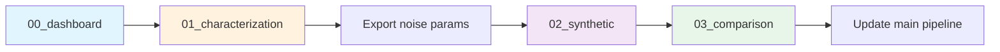

# Noise Model Development - Organization

## 📁 File Structure

```
ClopHfit/
├── 00_noise_model_dashboard.ipynb      # 🎯 START HERE - Overview & status
├── 01_noise_characterization.ipynb     # 🔬 Analyze real data
├── 02_synthetic_data_generator.ipynb   # 🧪 Build realistic synthetic data
├── 03_fitting_method_comparison.ipynb  # 📊 Compare GLS vs PyMC
├── prtecan_devel.ipynb                 # 📦 Original (preserved for reference)
└── dev/
    ├── README.md                        # 📖 Documentation
    ├── __init__.py                      # 🐍 Package definition
    └── noise_models.py                  # 🛠️ Reusable functions
```

## 🔄 Workflow



### Step-by-Step

1. **Dashboard (00)** - Get overview, check status
1. **Characterization (01)** - Analyze real prtecan data
   - Compute covariance matrices
   - Detect systematic bias (Issue 1)
   - Analyze adjacent correlation (Issue 2)
   - Test x-value uncertainty (Issue 3)
   - Export: `dev/cov_matrix_*.csv`, `dev/label_bias.csv`
1. **Synthetic Generator (02)** - Build realistic synthetic data
   - Load noise parameters from (01)
   - Implement noise model components
   - Validate synthetic vs real
1. **Method Comparison (03)** - Compare GLS vs PyMC
   - Test on synthetic (known truth)
   - Test on real data
   - Recommend best approach

## 🎯 Research Questions

| Issue | Question                                   | Analysis Function               | Notebook |
| ----- | ------------------------------------------ | ------------------------------- | -------- |
| 1     | Why is y1 at low pH always negative (>3σ)? | `analyze_label_bias()`          | 01       |
| 2     | Why do adjacent residuals alternate ±?     | `detect_adjacent_correlation()` | 01       |
| 3     | Are pH values systematically wrong?        | `estimate_x_shift_statistics()` | 01       |
| 4     | GLS vs PyMC - which is better?             | Full comparison                 | 03       |

## 🛠️ Key Functions (dev/noise_models.py)

### Analysis Functions

- `compute_residual_covariance()` - Covariance by label & x
- `analyze_label_bias()` - Detect systematic bias patterns
- `detect_adjacent_correlation()` - Test lag-1 correlation
- `estimate_x_shift_statistics()` - Detect pH shifts

### Simulation Functions

- `simulate_correlated_noise()` - Generate realistic noise
- `export_noise_parameters()` - Save for synthetic data

## 📊 Outputs

### From Notebook 01 → dev/

- `cov_matrix_y1.csv` - Covariance for y1 label
- `cov_matrix_y2.csv` - Covariance for y2 label
- `label_bias.csv` - Systematic bias by label
- `correlation_summary.csv` - Lag-1 correlation stats

### From Notebook 03

- Method comparison tables
- Performance metrics (bias, RMSE, coverage)
- Computational cost analysis
- **Final recommendation:** GLS or PyMC

## 🚀 Getting Started

```bash
# Open the dashboard
jupyter notebook 00_noise_model_dashboard.ipynb

# Or go directly to analysis
jupyter notebook 01_noise_characterization.ipynb
```

## 📝 Notes

- **Original notebook preserved:** `prtecan_devel.ipynb` (90 cells) kept for reference
- **Better organization:** Split into focused notebooks (60 + 31 + 22 cells)
- **Reusable code:** Functions extracted to `dev/noise_models.py`
- **Clear workflow:** Dashboard → Characterize → Synthesize → Compare

______________________________________________________________________

**Created:** 2025-12-22\
**Split from:** prtecan_devel.ipynb (90 cells → 3 focused notebooks)
