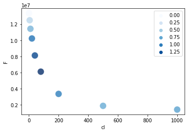
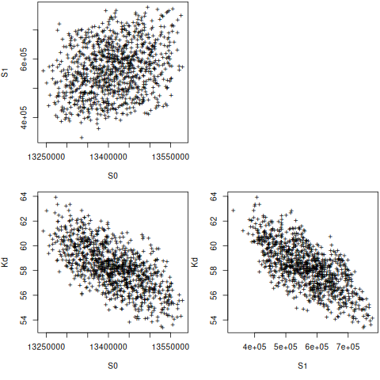
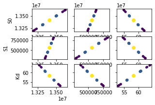
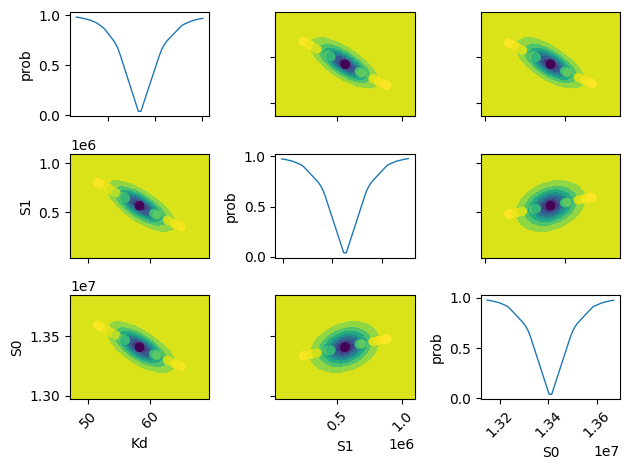
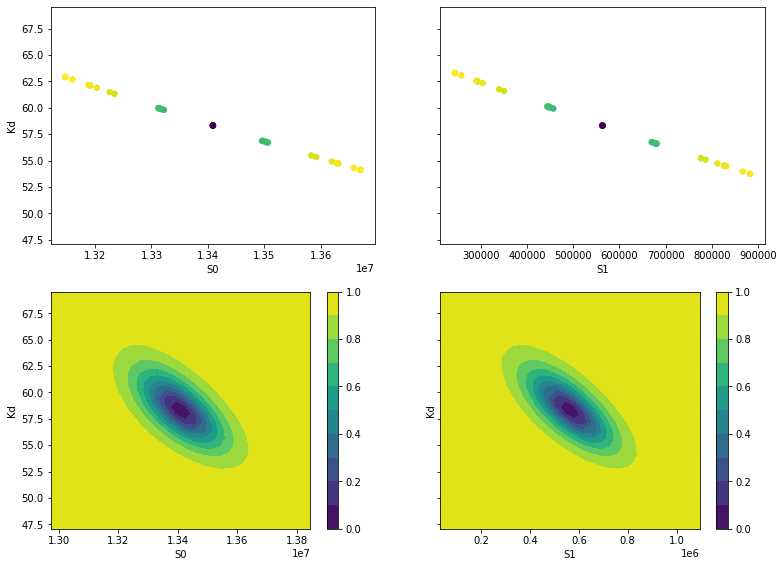
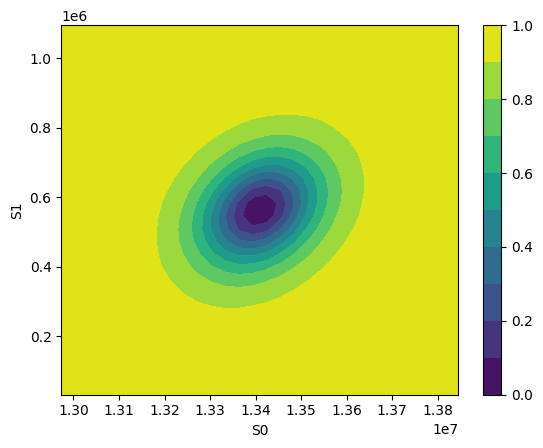

Fitting
-------

Requires:

- r-4.1.3-1

Conventions:
~~~~~~~~~~~~

- S0 Signal for unbound state

- S1 Signal for bound state

- K equilibrium constant (Kd or pKa)

- order data from unbound to bound (e.g. cl: 0–>150 mM; pH 9–>5)

Summary of best options
~~~~~~~~~~~~~~~~~~~~~~~

- lmfit.Model has very convenient results plot functionalities and the unique possibility to estimate upper lower fitting curves.

- R nls and nlsboot seems very convenient (Q-Q plt) and fast; nls can perform global fit but nlstools can not.

Initial imports
~~~~~~~~~~~~~~~

.. code:: python

    import numpy as np
    import scipy
    import pandas as pd
    import matplotlib.pyplot as plt
    import seaborn as sb
    import rpy2
    from rpy2.robjects import r
    from rpy2.robjects.packages import importr
    from rpy2.robjects import globalenv
    from rpy2.robjects import pandas2ri
    import lmfit

    pandas2ri.activate()
    %load_ext rpy2.ipython

    MASS = importr('MASS')
    #r('library(MASS)')

::

    The rpy2.ipython extension is already loaded. To reload it, use:
      %reload_ext rpy2.ipython

Single Cl titration.
~~~~~~~~~~~~~~~~~~~~

.. code:: python

    df = pd.read_table("../../tests/data/copyIP.txt")
    sb.scatterplot(data=df, x="cl", y="F", hue=df.cl*df.F**2.1, palette="Blues", s=200, alpha=.8)

Using R
^^^^^^^

.. code:: R

    d <- read.delim("../../tests/data/copyIP.txt")
    fit = nls(F ~ (S0 + S1 * cl / Kd)/ (1 + cl / Kd), start = list(S0=7e7, S1=0, Kd=12), data=d)
    summary(fit)

::

    Formula: F ~ (S0 + S1 * cl/Kd)/(1 + cl/Kd)

    Parameters:
        Estimate Std. Error t value Pr(>|t|)
    S0 1.341e+07  8.713e+04 153.894 5.08e-12 ***
    S1 5.635e+05  1.064e+05   5.296  0.00184 **
    Kd 5.832e+01  2.247e+00  25.957 2.16e-07 ***
    ---
    Signif. codes:  0 ‘***’ 0.001 ‘**’ 0.01 ‘*’ 0.05 ‘.’ 0.1 ‘ ’ 1

    Residual standard error: 118200 on 6 degrees of freedom

    Number of iterations to convergence: 6
    Achieved convergence tolerance: 1.608e-06

.. code:: R

    confint(fit)

::

    Waiting for profiling to be done...
               2.5%        97.5%
    S0 1.319762e+07 1.362273e+07
    S1 3.009078e+05 8.199737e+05
    Kd 5.313128e+01 6.407096e+01

.. code:: R

    library(nlstools)
    set.seed(4)
    nb = nlsBoot(fit, niter=999)
    summary(nb)

::

    ------
    Bootstrap statistics
           Estimate   Std. error
    S0 1.341194e+07 70877.210905
    S1 5.662159e+05 88287.461199
    Kd 5.827538e+01     1.834132

    ------
    Median of bootstrap estimates and percentile confidence intervals
             Median         2.5%        97.5%
    S0 1.341055e+07 1.328220e+07 1.354591e+07
    S1 5.662406e+05 4.108650e+05 7.369380e+05
    Kd 5.826980e+01 5.477262e+01 6.188986e+01

.. code:: R

    plot(nb)

.. image:: ../_static/r_bs.png

using rpy2
^^^^^^^^^^

.. code:: python

    globalenv['Rdf'] = df

    fit = rpy2.robjects.r('nls(F ~ (S0 + S1 * cl / Kd)/ (1 + cl / Kd), start = list(S0=7e7, S1=0, Kd=12), data=Rdf) ')
    globalenv['rfit'] = fit
    print(r.summary(fit))
    print(r.confint(fit))
    %R print("")
    %R print(confint(rfit))

::

    R[write to console]: Waiting for profiling to be done...

    Formula: F ~ (S0 + S1 * cl/Kd)/(1 + cl/Kd)

    Parameters:
        Estimate Std. Error t value Pr(>|t|)
    S0 1.341e+07  8.713e+04 153.894 5.08e-12 ***
    S1 5.635e+05  1.064e+05   5.296  0.00184 **
    Kd 5.832e+01  2.247e+00  25.957 2.16e-07 ***
    ---
    Signif. codes:  0 ‘***’ 0.001 ‘**’ 0.01 ‘*’ 0.05 ‘.’ 0.1 ‘ ’ 1

    Residual standard error: 118200 on 6 degrees of freedom

    Number of iterations to convergence: 6
    Achieved convergence tolerance: 1.608e-06

    [[1.31976181e+07 1.36227292e+07]
     [3.00907829e+05 8.19973684e+05]
     [5.31312807e+01 6.40709639e+01]]
    [1] ""
    R[write to console]: Waiting for profiling to be done...
               2.5%        97.5%
    S0 1.319762e+07 1.362273e+07
    S1 3.009078e+05 8.199737e+05
    Kd 5.313128e+01 6.407096e+01

::

    array([[1.31976181e+07, 1.36227292e+07],
           [3.00907829e+05, 8.19973684e+05],
           [5.31312807e+01, 6.40709639e+01]])

With older versions Rpy2 output looked nicer

.. code:: python

    print(MASS.confint_nls(fit, 'Kd'))
    print(rpy2.robjects.r('summary(rfit)'))

::

    R[write to console]: Waiting for profiling to be done...
    [53.13128065 64.07096394]

    Formula: F ~ (S0 + S1 * cl/Kd)/(1 + cl/Kd)

    Parameters:
        Estimate Std. Error t value Pr(>|t|)
    S0 1.341e+07  8.713e+04 153.894 5.08e-12 ***
    S1 5.635e+05  1.064e+05   5.296  0.00184 **
    Kd 5.832e+01  2.247e+00  25.957 2.16e-07 ***
    ---
    Signif. codes:  0 ‘***’ 0.001 ‘**’ 0.01 ‘*’ 0.05 ‘.’ 0.1 ‘ ’ 1

    Residual standard error: 118200 on 6 degrees of freedom

    Number of iterations to convergence: 6
    Achieved convergence tolerance: 1.608e-06

.. code:: python

    nlstools = importr('nlstools')
    base = importr('base')
    base.set_seed(4)
    nb = nlstools.nlsBoot(fit, niter=999)
    globalenv['nb'] = nb
    globalenv['fit'] = fit

.. code:: python

    %%R
    plot(nb)
    summary(nb)

::

    ------
    Bootstrap statistics
           Estimate   Std. error
    S0 1.341194e+07 70877.210905
    S1 5.662159e+05 88287.461199
    Kd 5.827538e+01     1.834132

    ------
    Median of bootstrap estimates and percentile confidence intervals
             Median         2.5%        97.5%
    S0 1.341055e+07 1.328220e+07 1.354591e+07
    S1 5.662406e+05 4.108650e+05 7.369380e+05
    Kd 5.826980e+01 5.477262e+01 6.188986e+01

lmfit
^^^^^

.. code:: python

    import lmfit

    def residual(pars, x, y=None):
        S0 =  pars['S0']
        S1 =  pars['S1']
        Kd = pars['Kd']
        model = (S0 + S1 * x / Kd) / (1 + x / Kd)
        if y is None:
            return model
        return (y - model)

    params = lmfit.Parameters()
    params.add('S0', value=df.F[0])
    params.add('S1', value=100)
    params.add('Kd', value=50, vary=True)

    out = lmfit.minimize(residual, params, args=(df.cl, df.F,))

    xdelta = (df.cl.max() - df.cl.min()) / 500
    xfit = np.arange(df.cl.min() - xdelta, df.cl.max() + xdelta, xdelta)
    yfit = residual(out.params, xfit)
    print(lmfit.fit_report(out.params))
    plt.plot(df.cl, df.F, "o", xfit, yfit, "-")

::

    [[Variables]]
        S0:  13408867.7 +/- 87130.4207 (0.65%) (init = 1.33579e+07)
        S1:  563536.896 +/- 106411.773 (18.88%) (init = 100)
        Kd:  58.3187813 +/- 2.24670302 (3.85%) (init = 50)
    [[Correlations]] (unreported correlations are < 0.100)
        C(S1, Kd) = -0.712
        C(S0, Kd) = -0.656
        C(S0, S1) = 0.275

.. image:: ../_static/lmfit1.png

.. code:: python

    import lmfit
    def residuals(p):
        S0 =  p['S0']
        S1 =  p['S1']
        Kd = p['Kd']
        model = (S0 + S1 * df.cl / Kd) / (1 + df.cl / Kd)
        return (model - df.F)

    mini = lmfit.Minimizer(residuals, params)
    res = mini.minimize()
    ci, tr = lmfit.conf_interval(mini, res, sigmas=[.68, .95], trace=True)
    print(lmfit.ci_report(ci, with_offset=False, ndigits=2))
    print(lmfit.fit_report(res, show_correl=False, sort_pars=True))

::

        95.00% 68.00% _BEST_ 68.00% 95.00%
     S0:13197619.5013314927.5313408867.6813503329.8013622726.90
     S1:300912.63447991.67563536.93677869.64819972.30
     Kd:  53.13  55.95  58.32  60.79  64.07
    [[Fit Statistics]]
        # fitting method   = leastsq
        # function evals   = 17
        # data points      = 9
        # variables        = 3
        chi-square         = 8.3839e+10
        reduced chi-square = 1.3973e+10
        Akaike info crit   = 212.594471
        Bayesian info crit = 213.186145
    [[Variables]]
        Kd:  58.3187808 +/- 2.24670301 (3.85%) (init = 50)
        S0:  13408867.7 +/- 87130.4216 (0.65%) (init = 1.33579e+07)
        S1:  563536.932 +/- 106411.771 (18.88%) (init = 100)

.. code:: python

    names = res.params.keys()
    i = 0
    gs = plt.GridSpec(4, 4)
    sx = {}
    sy = {}
    for fixed in names:
        j = 0
        for free in names:
            if j in sx and i in sy:
                ax = plt.subplot(gs[i, j], sharex=sx[j], sharey=sy[i])
            elif i in sy:
                ax = plt.subplot(gs[i, j], sharey=sy[i])
                sx[j] = ax
            elif j in sx:
                ax = plt.subplot(gs[i, j], sharex=sx[j])
                sy[i] = ax
            else:
                ax = plt.subplot(gs[i, j])
                sy[i] = ax
                sx[j] = ax
            if i < 3:
                plt.setp(ax.get_xticklabels(), visible=True)
            else:
                ax.set_xlabel(free)

            if j > 0:
                plt.setp(ax.get_yticklabels(), visible=False)
            else:
                ax.set_ylabel(fixed)

            rest = tr[fixed]
            prob = rest['prob']
            f = prob < 0.96

            x, y = rest[free], rest[fixed]
            ax.scatter(x[f], y[f], c=1-prob[f], s=25*(1-prob[f]+0.5))
            ax.autoscale(1, 1)
            j += 1
        i += 1

.. code:: python

    names = list(res.params.keys())

    plt.figure()
    for i in range(3):
        for j in range(3):
            indx = 9-j*3-i
            ax = plt.subplot(3, 3, indx)
            ax.ticklabel_format(style='sci', scilimits=(-2, 2), axis='y')

            # set-up labels and tick marks
            ax.tick_params(labelleft=False, labelbottom=False)
            if indx in (1, 4, 7):
                plt.ylabel(names[j])
                ax.tick_params(labelleft=True)
            if indx == 1:
                ax.tick_params(labelleft=True)
            if indx in (7, 8, 9):
                plt.xlabel(names[i])
                ax.tick_params(labelbottom=True)
                [label.set_rotation(45) for label in ax.get_xticklabels()]

            if i != j:
                x, y, m = lmfit.conf_interval2d(mini, res, names[i], names[j], 20, 20)
                plt.contourf(x, y, m, np.linspace(0, 1, 10))

                x = tr[names[i]][names[i]]
                y = tr[names[i]][names[j]]
                pr = tr[names[i]]['prob']
                s = np.argsort(x)
                plt.scatter(x[s], y[s], c=pr[s], s=30, lw=1)

            else:
                x = tr[names[i]][names[i]]
                y = tr[names[i]]['prob']

                t, s = np.unique(x, True)
                f = scipy.interpolate.interp1d(t, y[s], 'slinear')
                xn = np.linspace(x.min(), x.max(), 50)
                plt.plot(xn, f(xn), lw=1)
                plt.ylabel('prob')
                ax.tick_params(labelleft=True)

    plt.tight_layout()

.. code:: python

    lmfit.report_fit(out.params, min_correl=0.25)

    ci, trace = lmfit.conf_interval(mini, res, sigmas=[1, 2], trace=True)
    lmfit.printfuncs.report_ci(ci)

    fig, axes = plt.subplots(2, 2, figsize=(12.8, 9.6), sharey=True)
    cx1, cy1, prob = trace['S0']['S0'], trace['S0']['Kd'], trace['S0']['prob']
    cx2, cy2, prob2 = trace['S1']['S1'], trace['S1']['Kd'], trace['S1']['prob']

    axes[0][0].scatter(cx1, cy1, c=prob, s=30)
    axes[0][0].set_xlabel('S0')
    axes[0][0].set_ylabel('Kd')

    axes[0][1].scatter(cx2, cy2, c=prob2, s=30)
    axes[0][1].set_xlabel('S1')

    cx, cy, grid = lmfit.conf_interval2d(mini, res, 'S0', 'Kd', 30, 30)
    ctp = axes[1][0].contourf(cx, cy, grid, np.linspace(0, 1, 11))
    fig.colorbar(ctp, ax=axes[1][0])
    axes[1][0].set_xlabel('S0')
    axes[1][0].set_ylabel('Kd')

    cx, cy, grid = lmfit.conf_interval2d(mini, res, 'S1', 'Kd', 30, 30)
    ctp = axes[1][1].contourf(cx, cy, grid, np.linspace(0, 1, 11))
    fig.colorbar(ctp, ax=axes[1][1])
    axes[1][1].set_xlabel('S1')
    axes[1][1].set_ylabel('Kd')

::

    [[Variables]]
        S0:  13408867.7 +/- 87130.4207 (0.65%) (init = 1.33579e+07)
        S1:  563536.896 +/- 106411.773 (18.88%) (init = 100)
        Kd:  58.3187813 +/- 2.24670302 (3.85%) (init = 50)
    [[Correlations]] (unreported correlations are < 0.250)
        C(S1, Kd) = -0.712
        C(S0, Kd) = -0.656
        C(S0, S1) = 0.275
           95.45%    68.27%    _BEST_    68.27%    95.45%
     S0:-217181.70418-94515.7170213408867.68157+95044.78785+219828.89196
     S1:-270192.88583-116251.88156563536.93239+115024.53163+263649.25985
     Kd:  -5.32759  -2.37806  58.31878  +2.48962  +5.92348

.. code:: python

    x, y, grid = lmfit.conf_interval2d(mini, res, 'S0','S1', 30, 30)
    plt.contourf(x, y, grid, np.linspace(0,1,11))
    plt.xlabel('S0')
    plt.colorbar()
    plt.ylabel('S1')

Notes
~~~~~

You could implement global fitting using scipy.leastq but will sometime fail in bootstraping.
lmfit resulted much more robust

.. code:: python

    def fit_pH_global(fz, x, dy1, dy2):
        """Fit 2 dataset (x, y1, y2) with a single protonation site model
        """
        y1 = np.array(dy1)
        y2 = np.array(dy2)

        def ssq(p, x, y1, y2):
            return np.r_[y1 - fz(p[0], p[1:3], x), y2 - fz(p[0], p[3:5], x)]
        p0 = np.r_[x[2], y1[0], y1[-1], y2[0], y2[-1]]
        p, cov, info, msg, success = optimize.leastsq(ssq, p0, args=(x, y1, y2),
                                                      full_output=True, xtol=1e-11)
        res = namedtuple("Result", "success msg df chisqr K sK SA_1 sSA_1 \
                         SB_1 sSB_1 SA_2 sSA_2 SB_2 sSB_2")
        res.msg = msg
        res.success = success
        if 1 <= success <= 4:
            chisq = sum(info['fvec'] * info['fvec'])
            res.df = len(y1) + len(y2) - len(p)
            res.chisqr = chisq / res.df
            res.K = p[0]
            #res.sK = np.sqrt(cov[0][0] * res.chisqr)
            res.SA_1 = p[1]
            #res.sSA_1 = np.sqrt(cov[1][1] * res.chisqr)
            res.SB_1 = p[2]
            #res.sSB_1 = np.sqrt(cov[2][2] * res.chisqr)
            res.SA_2 = p[3]
            #res.sSA_2 = np.sqrt(cov[3][3] * res.chisqr)
            res.SB_2 = p[4]
            #res.sSB_2 = np.sqrt(cov[4][4] * res.chisqr)
        return res

    result = fit_pH_global(fz, df.x, df.y1, df.y2)
