Fit titration with multiple ts
------------------------------

For example data collected with multiple labelblocks in Tecan plate reader.

“A01”: pH titration with y1 and y2.

.. code:: python

    df = pd.read_csv('../../tests/data/A01.dat', sep=' ', names=['x', 'y1', 'y2'])
    df = df[::-1].reset_index(drop=True)
    df

.. table::

    +---+----------+---------+---------+
    | \ |        x |      y1 |      y2 |
    +===+==========+=========+=========+
    | 0 | 9.030000 | 29657.0 | 22885.0 |
    +---+----------+---------+---------+
    | 1 | 8.373333 | 35200.0 | 16930.0 |
    +---+----------+---------+---------+
    | 2 | 7.750000 | 44901.0 |  9218.0 |
    +---+----------+---------+---------+
    | 3 | 7.073333 | 53063.0 |  3758.0 |
    +---+----------+---------+---------+
    | 4 | 6.460000 | 54202.0 |  2101.0 |
    +---+----------+---------+---------+
    | 5 | 5.813333 | 54851.0 |  1542.0 |
    +---+----------+---------+---------+
    | 6 | 4.996667 | 51205.0 |  1358.0 |
    +---+----------+---------+---------+

lmfit of single y1 using analytical Jacobian
~~~~~~~~~~~~~~~~~~~~~~~~~~~~~~~~~~~~~~~~~~~~

It computes the Jacobian of the fz. Mind that the residual (i.e. y - fz) will be actually minimized.

.. code:: python

    import sympy
    x, S0_1, S1_1, K = sympy.symbols('x S0_1 S1_1 K')
    f = (S0_1 + S1_1 * 10 ** (K - x)) / (1 + 10 ** (K - x))
    print(sympy.diff(f, S0_1))
    print(sympy.diff(f, S1_1))
    print(sympy.diff(f, K))

::

    1/(10**(K - x) + 1)
    10**(K - x)/(10**(K - x) + 1)
    10**(K - x)*S1_1*log(10)/(10**(K - x) + 1) - 10**(K - x)*(10**(K - x)*S1_1 + S0_1)*log(10)/(10**(K - x) + 1)**2

.. code:: python

    f2 = (S0_1 + S1_1 * x / K) / (1 + x / K)
    print(sympy.diff(f2, S0_1))
    print(sympy.diff(f2, S1_1))
    print(sympy.diff(f2, K))

::

    1/(1 + x/K)
    x/(K*(1 + x/K))
    -S1_1*x/(K**2*(1 + x/K)) + x*(S0_1 + S1_1*x/K)/(K**2*(1 + x/K)**2)

.. code:: python

    def residual(pars, x, data):
        S0 =  pars['S0']
        S1 =  pars['S1']
        K = pars['K']
        #model = (S0 + S1 * x / Kd) / (1 + x / Kd)
        x = np.array(x)
        y = np.array(data)
        model = (S0 + S1 * 10 ** (K - x)) / (1 + 10 ** (K - x))
        if data is None:
            return model
        return (y - model)

    # Try Jacobian
    def dfunc(pars, x, data=None):
        S0_1 =  pars['S0']
        S1_1 =  pars['S1']
        K = pars['K']
        kx = np.array(10**(K - x))
        return np.array([-1 / (kx + 1),
                         -kx / (kx + 1),
                         -kx * np.log(10) * (S1_1 / (kx + 1) - (kx * S1_1 + S0_1) / (kx + 1)**2)])
                         # kx * S1_1 * np.log(10) / (kx + 1) - kx * (kx * S1_1 + S0_1) * np.log(10) / (kx + 1)**2])

    params = lmfit.Parameters()
    params.add('S0', value=25000, min=0.0)
    params.add('S1', value=50000, min=0.0)
    params.add('K', value=7, min=2.0, max=12.0)

    # out = lmfit.minimize(residual, params, args=(df.x,), kws={'data':df.y1})
    # mini = lmfit.Minimizer(residual, params, fcn_args=(df.x, df.y2))
    mini = lmfit.Minimizer(residual, params, fcn_args=(df.x,), fcn_kws={'data':df.y1})
    # res= mini.minimize()
    res= mini.leastsq(Dfun=dfunc, col_deriv=True, ftol=1e-8)

    fit = residual(params, df.x, None)
    print(lmfit.report_fit(res))

    ci = lmfit.conf_interval(mini, res, sigmas=[1, 2, 3])
    lmfit.printfuncs.report_ci(ci)

::

    [[Fit Statistics]]
        # fitting method   = leastsq
        # function evals   = 9
        # data points      = 7
        # variables        = 3
        chi-square         = 12308015.2
        reduced chi-square = 3077003.79
        Akaike info crit   = 106.658958
        Bayesian info crit = 106.496688
    [[Variables]]
        S0:  26638.8377 +/- 2455.91825 (9.22%) (init = 25000)
        S1:  54043.3592 +/- 979.995977 (1.81%) (init = 50000)
        K:   8.06961091 +/- 0.14940678 (1.85%) (init = 7)
    [[Correlations]] (unreported correlations are < 0.100)
        C(S0, K)  = -0.775
        C(S1, K)  = -0.455
        C(S0, S1) = 0.205
    None
    /home/dan/workspace/ClopHfit/.hatch/clophfit/lib/python3.10/site-packages/lmfit/confidence.py:317: UserWarning: Bound reached with prob(S0=0.0) = 0.9944737517813054 < max(sigmas)
      warn(errmsg)
           99.73%    95.45%    68.27%    _BEST_    68.27%    95.45%    99.73%
     S0:      -inf-8376.38956-2895.5618126638.83771+2558.77424+5999.31275+12360.60692
     S1:-6192.81418-2734.30623-1098.2204254043.35921+1113.18257+2829.54298+6725.37841
     K :  -0.98139  -0.40197  -0.15949   8.06961  +0.16276  +0.42591  +1.17272

.. code:: python

    print(lmfit.ci_report(ci, with_offset=False, ndigits=2))

::

       99.73% 95.45% 68.27% _BEST_ 68.27% 95.45% 99.73%
    S0:   -inf18262.4523743.2826638.8429197.6132638.1538999.44
    S1:47850.5551309.0552945.1454043.3655156.5456872.9060768.74
    K :   7.09   7.67   7.91   8.07   8.23   8.50   9.24

emcee
^^^^^

.. code:: python

    res.params.add('__lnsigma', value=np.log(.1), min=np.log(0.001), max=np.log(1e4))
    resMC = lmfit.minimize(residual, method='emcee', steps=3000,
                            nan_policy='omit', is_weighted=False, burn=300, thin=1,
                           params=res.params, args=(df.x, df.y1), progress=True)

::

    100% 3000/3000 [00:36<00:00, 81.99it/s]
    The chain is shorter than 50 times the integrated autocorrelation time for 4 parameter(s). Use this estimate with caution and run a longer chain!
    N/50 = 60;
    tau: [ 89.90422082 126.15518337 114.08544671  82.49207071]

.. code:: python

    plt.plot(resMC.acceptance_fraction, 'o')
    plt.xlabel('walker')
    plt.ylabel('acceptance frac')

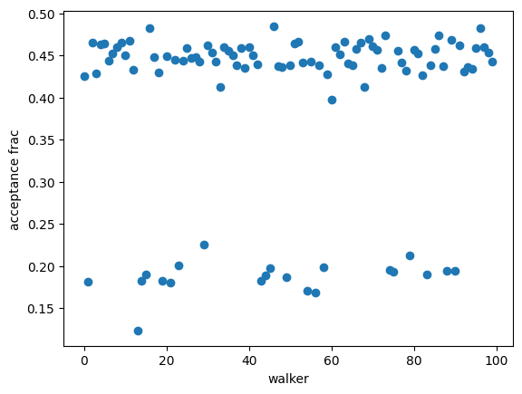

.. code:: python

    import corner

    tr = [v for v in resMC.params.valuesdict().values()]
    emcee_plot = corner.corner(resMC.flatchain, labels=resMC.var_names,
                                truths=list(resMC.params.valuesdict().values()))
                                # truths=tr[:-1])

::

    WARNING:root:Too few points to create valid contours
    WARNING:root:Too few points to create valid contours
    WARNING:root:Too few points to create valid contours

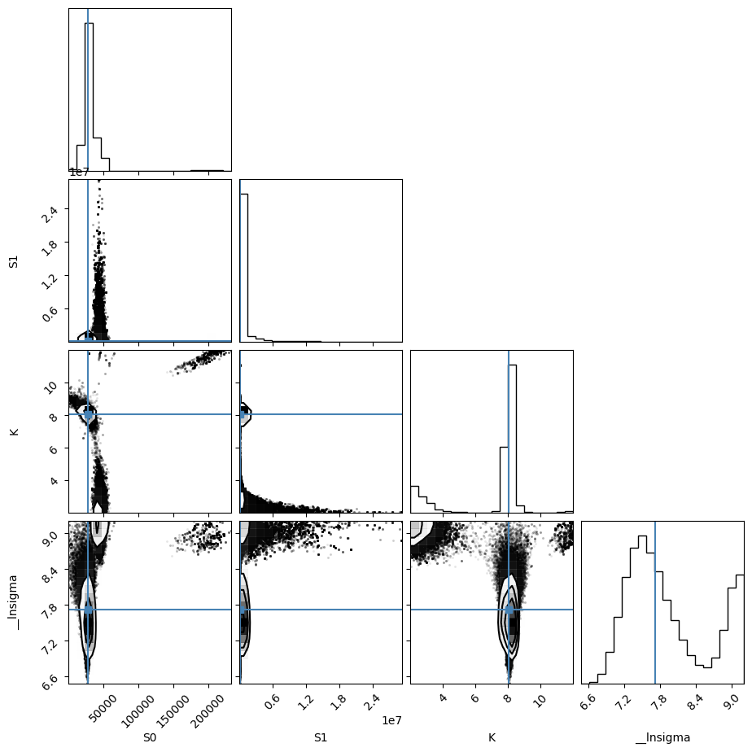

global
~~~~~~

I believe I was using scipy.optimize.

using lmfit with np.r\_ trick
^^^^^^^^^^^^^^^^^^^^^^^^^^^^^

.. code:: python

    # %%timeit #62ms
    def residual2(pars, x, data=None):
        K = pars['K']
        S0_1 =  pars['S0_1']
        S1_1 =  pars['S1_1']
        S0_2 =  pars['S0_2']
        S1_2 =  pars['S1_2']
        model_0 = (S0_1 + S1_1 * 10 ** (K - x[0])) / (1 + 10 ** (K - x[0]))
        model_1 = (S0_2 + S1_2 * 10 ** (K - x[1])) / (1 + 10 ** (K - x[1]))
        if data is None:
            return np.r_[model_0, model_1]
        return np.r_[data[0] - model_0, data[1] - model_1]

    params2 = lmfit.Parameters()
    params2.add('K', value=7.0, min=2.0, max=12.0)
    params2.add('S0_1', value=df.y1[0], min=0.0)
    params2.add('S0_2', value=df.y2[0], min=0.0)
    params2.add('S1_1', value=df.y1.iloc[-1], min=0.0)
    params2.add('S1_2', value=df.y2.iloc[-1], min=0.0)
    mini2 = lmfit.Minimizer(residual2, params2, fcn_args=([df.x, df.x],), fcn_kws={'data': [df.y1, df.y2]})
    res2 = mini2.minimize()
    print(lmfit.fit_report(res2))

    ci2, tr2 = lmfit.conf_interval(mini2, res2, sigmas=[.68, .95], trace=True)
    print(lmfit.ci_report(ci2, with_offset=False, ndigits=2))

::

    [[Fit Statistics]]
        # fitting method   = leastsq
        # function evals   = 37
        # data points      = 14
        # variables        = 5
        chi-square         = 12471473.3
        reduced chi-square = 1385719.25
        Akaike info crit   = 201.798560
        Bayesian info crit = 204.993846
    [[Variables]]
        K:     8.07255057 +/- 0.07600744 (0.94%) (init = 7)
        S0_1:  26601.3422 +/- 1425.69369 (5.36%) (init = 29657)
        S0_2:  25084.4220 +/- 1337.07555 (5.33%) (init = 22885)
        S1_1:  54034.5797 +/- 627.642878 (1.16%) (init = 51205)
        S1_2:  1473.57942 +/- 616.944953 (41.87%) (init = 1358)
    [[Correlations]] (unreported correlations are < 0.100)
        C(K, S0_1)    = -0.682
        C(K, S0_2)    = 0.626
        C(S0_1, S0_2) = -0.426
        C(K, S1_1)    = -0.361
        C(K, S1_2)    = 0.316
        C(S0_2, S1_1) = -0.226
        C(S0_1, S1_2) = -0.215
        C(S1_1, S1_2) = -0.114
          95.00% 68.00% _BEST_ 68.00% 95.00%
     K   :   7.91   7.99   8.07   8.15   8.24
     S0_1:23210.9025078.6226601.3428045.4929623.53
     S0_2:22232.9723723.9425084.4226514.8828263.75
     S1_1:52629.0453378.2454034.5854695.2655460.17
     S1_2:  72.04 824.011473.582118.982855.89

.. code:: python

    xfit = np.linspace(df.x.min(), df.x.max(), 100)
    yfit0 = residual2(params2, [xfit, xfit])
    yfit0 = yfit0.reshape(2, 100)
    yfit = residual2(res2.params, [xfit, xfit])
    yfit = yfit.reshape(2, 100)
    plt.plot(df.x, df.y1, 'o', df.x, df.y2, 's', xfit, yfit[0], '-', xfit, yfit[1], '-', xfit, yfit0[0], '--', xfit, yfit0[1], '--')
    plt.grid(True)

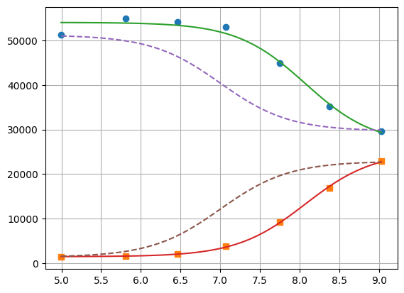

lmfit constraints aiming for generality
^^^^^^^^^^^^^^^^^^^^^^^^^^^^^^^^^^^^^^^

I believe a name convention would be more robust than relying on OrderedDict Params object.

.. code:: python

    "S0_1".split("_")[0]

::

    S0

.. code:: python

    def exception_fcn_handler(func):
        def inner_function(*args, **kwargs):
            try:
                return func(*args, **kwargs)
            except TypeError:
                print(f"{func.__name__} only takes (1D) vector as argument besides lmfit.Parameters.")
        return inner_function

    @exception_fcn_handler
    def titration_pH(params, pH):
        p = {k.split("_")[0]: v for k, v in params.items()}
        return (p["S0"] + p["S1"] * 10 ** (p["K"] - pH)) / (1 + 10 ** (p["K"] - pH))

    def residues(params, x, y, fcn):
        return y - fcn(params, x)

    p1 = lmfit.Parameters()
    p2 = lmfit.Parameters()
    p1.add("K_1", value=7., min=2.0, max=12.0)
    p2.add("K_2", value=7., min=2.0, max=12.0)
    p1.add("S0_1", value=df.y1.iloc[0], min=0.0)
    p2.add("S0_2", value=df.y2.iloc[0], min=0.0)
    p1.add("S1_1", value=df.y1.iloc[-1], min=0.0)
    p2.add("S1_2", value=df.y2.iloc[-1], min=0.0)

    print(residues(p1, np.array(df.x), [1.97, 1.8, 1.7, 0.1, 0.1, .16, .01], titration_pH))

    def gobjective(params, xl, yl, fcnl):
        nset = len(xl)
        res = []
        for i in range(nset):
            pi = {k: v for k, v in params.valuesdict().items() if k[-1]==f"{i+1}"}
            res = np.r_[res, residues(pi, xl[i], yl[i], fcnl[i])]
            # res = np.r_[res, yl[i] - fcnl[i](parsl[i], x[i])]
        return res

    print(gobjective(p1+p2, [df.x, df.x], [df.y1, df.y2], [titration_pH, titration_pH]))

::

    [-29854.26823732 -30530.32007939 -32908.60749879 -39523.42660007
     -46381.47878947 -49888.5091843  -50993.25866394]
    [  -199.23823732   4667.87992061  11990.69250121  13539.47339993
       7820.42121053   4962.3308157     211.73133606    199.04406603
      -5080.73278499 -10416.86307191  -9270.08900503  -4075.72045662
      -1131.04796128   -211.52498939]

Here single.

.. code:: python

    mini = lmfit.Minimizer(residues, p1, fcn_args=(df.x, df.y1, titration_pH, ))
    res= mini.minimize()

    fit = titration_pH(res.params, df.x)
    print(lmfit.report_fit(res))
    plt.plot(df.x, df.y1, "o", df.x, fit, "--")
    ci = lmfit.conf_interval(mini, res, sigmas=[1, 2])
    lmfit.printfuncs.report_ci(ci)

::

    [[Fit Statistics]]
        # fitting method   = leastsq
        # function evals   = 25
        # data points      = 7
        # variables        = 3
        chi-square         = 12308015.2
        reduced chi-square = 3077003.79
        Akaike info crit   = 106.658958
        Bayesian info crit = 106.496688
    [[Variables]]
        K_1:   8.06961101 +/- 0.14940677 (1.85%) (init = 7)
        S0_1:  26638.8364 +/- 2455.91626 (9.22%) (init = 29657)
        S1_1:  54043.3589 +/- 979.996129 (1.81%) (init = 51205)
    [[Correlations]] (unreported correlations are < 0.100)
        C(K_1, S0_1)  = -0.775
        C(K_1, S1_1)  = -0.455
        C(S0_1, S1_1) = 0.205
    None
             95.45%    68.27%    _BEST_    68.27%    95.45%
     K_1 :  -0.40197  -0.15949   8.06961  +0.16276  +0.42592
     S0_1:-8376.38827-2895.5605426638.83642+2558.77552+5999.33126
     S1_1:-2734.30657-1098.2200654043.35891+1113.18279+2829.55530

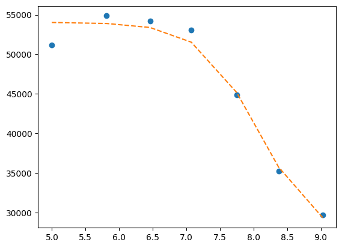

Now global.

.. code:: python

    # %%timeit #66ms
    pg = p1 + p2
    pg['K_2'].expr = 'K_1'
    # gmini = lmfit.Minimizer(gobjective, pg, fcn_args=([df.x[1:], df.x], [df.y1[1:], df.y2], [titration_pH, titration_pH]))
    gmini = lmfit.Minimizer(gobjective, pg, fcn_args=([df.x, df.x], [df.y1, df.y2], [titration_pH, titration_pH]))
    gres= gmini.minimize()
    print(lmfit.fit_report(gres))

    pp1 = {k: v for k, v in gres.params.valuesdict().items() if k.split("_")[1]==f"{1}"}
    pp2 = {k: v for k, v in gres.params.valuesdict().items() if k.split("_")[1]==f"{2}"}
    xfit = np.linspace(df.x.min(), df.x.max(), 100)
    yfit1 = titration_pH(pp1, xfit)
    yfit2 = titration_pH(pp2, xfit)
    plt.plot(df.x, df.y1, "o", xfit, yfit1, "--")
    plt.plot(df.x, df.y2, "s", xfit, yfit2, "--")
    ci = lmfit.conf_interval(gmini, gres, sigmas=[1, 0.95])
    print(lmfit.ci_report(ci, with_offset=False, ndigits=2))

::

    [[Fit Statistics]]
        # fitting method   = leastsq
        # function evals   = 37
        # data points      = 14
        # variables        = 5
        chi-square         = 12471473.3
        reduced chi-square = 1385719.25
        Akaike info crit   = 201.798560
        Bayesian info crit = 204.993846
    [[Variables]]
        K_1:   8.07255057 +/- 0.07600744 (0.94%) (init = 7)
        S0_1:  26601.3422 +/- 1425.69369 (5.36%) (init = 29657)
        S1_1:  54034.5797 +/- 627.642878 (1.16%) (init = 51205)
        K_2:   8.07255057 +/- 0.07600744 (0.94%) == 'K_1'
        S0_2:  25084.4220 +/- 1337.07555 (5.33%) (init = 22885)
        S1_2:  1473.57942 +/- 616.944953 (41.87%) (init = 1358)
    [[Correlations]] (unreported correlations are < 0.100)
        C(K_1, S0_1)  = -0.682
        C(K_1, S0_2)  = 0.626
        C(S0_1, S0_2) = -0.426
        C(K_1, S1_1)  = -0.361
        C(K_1, S1_2)  = 0.316
        C(S1_1, S0_2) = -0.226
        C(S0_1, S1_2) = -0.215
        C(S1_1, S1_2) = -0.114

::

    ---------------------------------------------------------------------------
    ValueError                                Traceback (most recent call last)
    Cell In[79], line 16
         14 plt.plot(df.x, df.y1, "o", xfit, yfit1, "--")
         15 plt.plot(df.x, df.y2, "s", xfit, yfit2, "--")
    ---> 16 ci = lmfit.conf_interval(gmini, gres, sigmas=[1, 0.95])
         17 print(lmfit.ci_report(ci, with_offset=False, ndigits=2))

    File ~/workspace/ClopHfit/.hatch/clophfit/lib/python3.10/site-packages/lmfit/confidence.py:143, in conf_interval(minimizer, result, p_names, sigmas, trace, maxiter, verbose, prob_func)
        139     sigmas = [1, 2, 3]
        141 ci = ConfidenceInterval(minimizer, result, p_names, prob_func, sigmas,
        142                         trace, verbose, maxiter)
    --> 143 output = ci.calc_all_ci()
        144 if trace:
        145     return output, ci.trace_dict

    File ~/workspace/ClopHfit/.hatch/clophfit/lib/python3.10/site-packages/lmfit/confidence.py:218, in ConfidenceInterval.calc_all_ci(self)
        215 out = {}
        217 for p in self.p_names:
    --> 218     out[p] = (self.calc_ci(p, -1)[::-1] +
        219               [(0., self.params[p].value)] +
        220               self.calc_ci(p, 1))
        221 if self.trace:
        222     self.trace_dict = map_trace_to_names(self.trace_dict, self.params)

    File ~/workspace/ClopHfit/.hatch/clophfit/lib/python3.10/site-packages/lmfit/confidence.py:258, in ConfidenceInterval.calc_ci(self, para, direction)
        255     ret.append((prob, direction*np.inf))
        256     continue
    --> 258 sol = root_scalar(calc_prob, method='toms748', bracket=sorted([limit, a_limit]), rtol=.5e-4, args=(prob,))
        259 if sol.converged:
        260     val = sol.root

    File ~/workspace/ClopHfit/.hatch/clophfit/lib/python3.10/site-packages/scipy/optimize/_root_scalar.py:275, in root_scalar(f, args, method, bracket, fprime, fprime2, x0, x1, xtol, rtol, maxiter, options)
        272         raise ValueError('Bracket needed for %s' % method)
        274     a, b = bracket[:2]
    --> 275     r, sol = methodc(f, a, b, args=args, **kwargs)
        276 elif meth in ['secant']:
        277     if x0 is None:

    File ~/workspace/ClopHfit/.hatch/clophfit/lib/python3.10/site-packages/scipy/optimize/_zeros_py.py:1374, in toms748(f, a, b, args, k, xtol, rtol, maxiter, full_output, disp)
       1372     args = (args,)
       1373 solver = TOMS748Solver()
    -> 1374 result = solver.solve(f, a, b, args=args, k=k, xtol=xtol, rtol=rtol,
       1375                       maxiter=maxiter, disp=disp)
       1376 x, function_calls, iterations, flag = result
       1377 return _results_select(full_output, (x, function_calls, iterations, flag))

    File ~/workspace/ClopHfit/.hatch/clophfit/lib/python3.10/site-packages/scipy/optimize/_zeros_py.py:1221, in TOMS748Solver.solve(self, f, a, b, args, xtol, rtol, k, maxiter, disp)
       1219 r"""Solve f(x) = 0 given an interval containing a zero."""
       1220 self.configure(xtol=xtol, rtol=rtol, maxiter=maxiter, disp=disp, k=k)
    -> 1221 status, xn = self.start(f, a, b, args)
       1222 if status == _ECONVERGED:
       1223     return self.get_result(xn)

    File ~/workspace/ClopHfit/.hatch/clophfit/lib/python3.10/site-packages/scipy/optimize/_zeros_py.py:1121, in TOMS748Solver.start(self, f, a, b, args)
       1118     return _ECONVERGED, b
       1120 if np.sign(fb) * np.sign(fa) > 0:
    -> 1121     raise ValueError("a, b must bracket a root f(%e)=%e, f(%e)=%e " %
       1122                      (a, fa, b, fb))
       1123 self.fab[:] = [fa, fb]
       1125 return _EINPROGRESS, sum(self.ab) / 2.0

    ValueError: a, b must bracket a root f(7.844528e+00)=3.045473e-01, f(7.906050e+00)=2.673105e-01

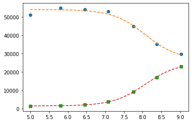

To plot ci for the 5 parameters.

.. code:: python

    fig, axes = plt.subplots(1, 4, figsize=(24.2, 4.8), sharey=True)
    cx, cy, grid = lmfit.conf_interval2d(gmini, gres, 'S0_1', 'K_1', 25, 25)
    ctp = axes[0].contourf(cx, cy, grid, np.linspace(0, 1, 11))
    fig.colorbar(ctp, ax=axes[0])
    axes[0].set_xlabel('SA1')
    axes[0].set_ylabel('pK1')
    cx, cy, grid = lmfit.conf_interval2d(gmini, gres, 'S0_2', 'K_1', 25, 25)
    ctp = axes[1].contourf(cx, cy, grid, np.linspace(0, 1, 11))
    fig.colorbar(ctp, ax=axes[1])
    axes[1].set_xlabel('SA2')
    axes[1].set_ylabel('pK1')
    cx, cy, grid = lmfit.conf_interval2d(gmini, gres, 'S1_1', 'K_1', 25, 25)
    ctp = axes[2].contourf(cx, cy, grid, np.linspace(0, 1, 11))
    fig.colorbar(ctp, ax=axes[2])
    axes[2].set_xlabel('SB1')
    axes[2].set_ylabel('pK1')
    cx, cy, grid = lmfit.conf_interval2d(gmini, gres, 'S1_2', 'K_1', 25, 25)
    ctp = axes[3].contourf(cx, cy, grid, np.linspace(0, 1, 11))
    fig.colorbar(ctp, ax=axes[3])
    axes[3].set_xlabel('SB2')
    axes[3].set_ylabel('pK1')

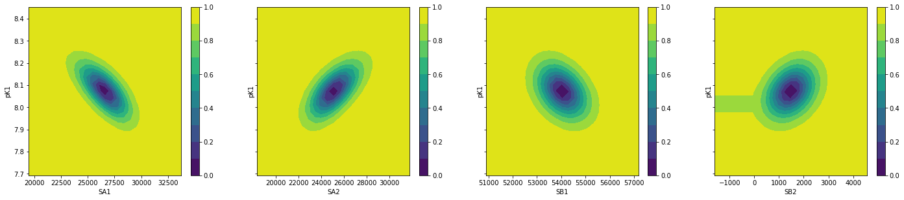

.. code:: python

    plt.plot(np.r_[df.x, df.x], gres.residual, "o")

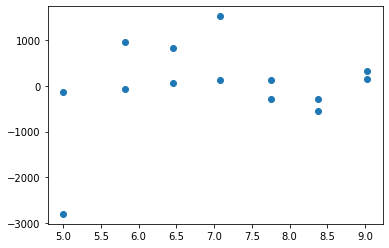

emcee
:::::

.. code:: python

    gmini.params.add('__lnsigma', value=np.log(.1), min=np.log(0.001), max=np.log(2))
    gresMC = lmfit.minimize(gobjective, method='emcee', steps=1800, #workers=8,
                            nan_policy='omit', burn=30, is_weighted=False, #thin=20,
                            params=gmini.params, args=([df.x, df.x], [df.y1, df.y2], [titration_pH, titration_pH]), progress=True)

::

    100% 1800/1800 [05:17<00:00,  5.66it/s]
    The chain is shorter than 50 times the integrated autocorrelation time for 5 parameter(s). Use this estimate with caution and run a longer chain!
    N/50 = 36;
    tau: [ 25.20679429  64.86628075  40.01735791  82.79200202 114.97290655
      87.1914766 ]

This next block comes from: `https://lmfit.github.io/lmfit-py/examples/example_emcee_Model_interface.html?highlight=emcee <https://lmfit.github.io/lmfit-py/examples/example_emcee_Model_interface.html?highlight=emcee>`_

.. code:: python

    emcee_kws = dict(steps=5000, burn=500, thin=20, is_weighted=False,)
    emcee_params = gmini.params.copy()
    emcee_params.add('__lnsigma', value=np.log(0.1), min=np.log(0.001), max=np.log(2.0))

    mi = lmfit.Minimizer(gobjective, emcee_params, fcn_args=([df.x, df.x], [df.y1, df.y2], [titration_pH, titration_pH]))

    res_emcee = mi.minimize(method="emcee", steps=500, burn=50, thin=20, is_weighted=False)

::

    100% 500/500 [01:34<00:00,  5.30it/s]
    The chain is shorter than 50 times the integrated autocorrelation time for 6 parameter(s). Use this estimate with caution and run a longer chain!
    N/50 = 10;
    tau: [29.23479726 21.62881729 35.43287521 36.66580039 29.46506312 60.95433911]

.. code:: python

    # result_emcee = model.fit(data=y, x=x, params=emcee_params, method='emcee',
    #                          nan_policy='omit', fit_kws=emcee_kws)

    lmfit.report_fit(res_emcee)

::

    [[Fit Statistics]]
        # fitting method   = emcee
        # function evals   = 50000
        # data points      = 14
        # variables        = 6
        chi-square         = 3126257.04
        reduced chi-square = 390782.130
        Akaike info crit   = 184.428056
        Bayesian info crit = 188.262400
    [[Variables]]
        K_1:        8.07253629 +/- 0.02377606 (0.29%) (init = 8.072551)
        S0_1:       26607.0352 +/- 221.686080 (0.83%) (init = 26601.34)
        S1_1:       54031.8395 +/- 593.213078 (1.10%) (init = 54034.58)
        K_2:        8.07253629 == 'K_1'
        S0_2:       25011.8630 +/- 1294.50486 (5.18%) (init = 25084.42)
        S1_2:       1473.83633 +/- 88.7501077 (6.02%) (init = 1473.579)
        __lnsigma:  0.69209236 +/- 0.11961456 (17.28%) (init = -2.302585)
    [[Correlations]] (unreported correlations are < 0.100)
        C(S1_1, S0_2) = 0.913
        C(S0_1, S0_2) = -0.666
        C(S0_1, S1_1) = -0.632
        C(K_1, S0_1)  = -0.373
        C(K_1, S1_1)  = -0.265
        C(S0_2, S1_2) = -0.239
        C(K_1, S1_2)  = 0.238
        C(S1_1, S1_2) = -0.215
        C(K_1, S0_2)  = -0.201

.. code:: python

    plt.plot(gresMC.acceptance_fraction, 'o')
    plt.xlabel('walker')
    plt.ylabel('acceptance frac')

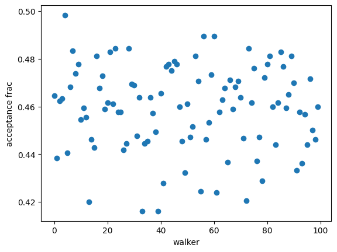

.. code:: python

    import corner

    tr = [v for v in gresMC.params.valuesdict().values()]
    emcee_plot = corner.corner(gresMC.flatchain, labels=gresMC.var_names,
                                # truths=list(gresMC.params.valuesdict().values()))
                                truths=tr[:-1])

::

    WARNING:root:Too few points to create valid contours
    WARNING:root:Too few points to create valid contours
    WARNING:root:Too few points to create valid contours
    WARNING:root:Too few points to create valid contours
    WARNING:root:Too few points to create valid contours
    WARNING:root:Too few points to create valid contours
    WARNING:root:Too few points to create valid contours
    WARNING:root:Too few points to create valid contours
    WARNING:root:Too few points to create valid contours
    WARNING:root:Too few points to create valid contours
    WARNING:root:Too few points to create valid contours
    WARNING:root:Too few points to create valid contours
    WARNING:root:Too few points to create valid contours
    WARNING:root:Too few points to create valid contours
    WARNING:root:Too few points to create valid contours

.. image:: ../_static/emcee-12.png

.. code:: python

    lmfit.report_fit(gresMC.params)

::

    [[Variables]]
        K_1:        8.07256863 +/- 1.8571e-04 (0.00%) (init = 8.072551)
        S0_1:       26601.2542 +/- 3.55016167 (0.01%) (init = 26601.34)
        S1_1:       54034.8079 +/- 1.60777173 (0.00%) (init = 54034.58)
        K_2:        8.07256863 == 'K_1'
        S0_2:       25084.6292 +/- 3.32916391 (0.01%) (init = 25084.42)
        S1_2:       1473.87013 +/- 4.74264114 (0.32%) (init = 1473.579)
        __lnsigma:  0.69314685 +/- 2.5390e-05 (0.00%) (init = -2.302585)
    [[Correlations]] (unreported correlations are < 0.100)
        C(S0_1, S1_2)      = 0.914
        C(S0_2, S1_2)      = 0.698
        C(K_1, S0_1)       = -0.587
        C(K_1, S1_1)       = -0.545
        C(S0_1, S1_1)      = 0.479
        C(S0_1, S0_2)      = 0.475
        C(S1_1, S1_2)      = 0.465
        C(K_1, S1_2)       = -0.379
        C(S0_2, __lnsigma) = -0.165
        C(S0_1, __lnsigma) = -0.157
        C(S1_1, S0_2)      = 0.156
        C(S1_2, __lnsigma) = -0.156
        C(K_1, __lnsigma)  = 0.133

.. code:: python

    highest_prob = np.argmax(gresMC.lnprob)
    hp_loc = np.unravel_index(highest_prob, gresMC.lnprob.shape)
    mle_soln = gresMC.chain[hp_loc]
    for i, par in enumerate(pg):
        pg[par].value = mle_soln[i]

    print('\nMaximum Likelihood Estimation from emcee       ')
    print('-------------------------------------------------')
    print('Parameter  MLE Value   Median Value   Uncertainty')
    fmt = '  {:5s}  {:11.5f} {:11.5f}   {:11.5f}'.format
    for name, param in pg.items():
        print(fmt(name, param.value, gresMC.params[name].value,
                  gresMC.params[name].stderr))

.. code:: python

    print('\nError estimates from emcee:')
    print('------------------------------------------------------')
    print('Parameter  -2sigma  -1sigma   median  +1sigma  +2sigma')

    for name in pg.keys():
        quantiles = np.percentile(gresMC.flatchain[name],
                                  [2.275, 15.865, 50, 84.135, 97.275])
        median = quantiles[2]
        err_m2 = quantiles[0] - median
        err_m1 = quantiles[1] - median
        err_p1 = quantiles[3] - median
        err_p2 = quantiles[4] - median
        fmt = '  {:5s}   {:8.4f} {:8.4f} {:8.4f} {:8.4f} {:8.4f}'.format
        print(fmt(name, err_m2, err_m1, median, err_p1, err_p2))

bootstrap con pandas
^^^^^^^^^^^^^^^^^^^^

.. code:: python

    %%timeit
    for i in range(100):
        tdf = pd.DataFrame([(j, i) for i in range(7) for j in range(2)]).sample(14, replace=True, ignore_index=False)
        df1 = df[["x", "y1"]].iloc[np.array(tdf[tdf[0]==0][1])]
        df2 = df[["x", "y2"]].iloc[np.array(tdf[tdf[0]==1][1])]

.. code:: python

    # %%timeit
    def idx_sample(npoints):
        tidx = []
        for i in range(npoints):
            tidx.append((np.random.randint(2), np.random.randint(7)))
        idx1 = []
        idx2 = []
        for t in tidx:
            if t[0] == 0:
                idx1.append(t[1])
            elif t[0] == 1:
                idx2.append(t[1])
            else:
                raise Exception("Must never occur")
        return idx1, idx2

    for i in range(100):
        idx1, idx2 = idx_sample(14)
        df1 = df[["x", "y1"]].iloc[idx1].sort_values(by="x", ascending=False).reset_index(drop=True)
        df2 = df[["x", "y2"]].iloc[idx2].sort_values(by="x", ascending=False).reset_index(drop=True)

.. code:: python

    # %%timeit  #5-6 s for nboot=7 now 0.4s
    n_points = len(df)
    nboot=199
    np.random.seed(5)
    best = lmfit.minimize(gobjective, pg, args=([df.x[1:], df.x], [df.y1[1:], df.y2], [titration_pH, titration_pH]))
    nb = {k: [] for k in best.params.keys()}

    for i in range(nboot):
        idx1, idx2 = idx_sample(13)
        df1 = df[["x", "y1"]].iloc[idx1].sort_values(by="x", ascending=False).reset_index(drop=True)
        df2 = df[["x", "y2"]].iloc[idx2].sort_values(by="x", ascending=False).reset_index(drop=True)
        # boot_idxs = np.random.randint(0, n_points, n_points)
        # df2 = df.iloc[boot_idxs]
        # df2=df2.sort_values(by="x", ascending=False).reset_index(drop=True)
        # # df2.reset_index(drop=True, inplace=True)
        # boot_idxs = np.random.randint(0, n_points, n_points)
        # df3 = df.iloc[boot_idxs]
        # # df3.reset_index(drop=True, inplace=True)
        # df3=df3.sort_values(by="x", ascending=False).reset_index(drop=True)
        try:
            out = lmfit.minimize(gobjective, best.params,
                                 args=([df1.x, df2.x], [df1.y1, df2.y2], [titration_pH, titration_pH]),
                                 calc_covar=False, method="leastsq", nan_policy="omit",  scale_covar=False)
            for k,v in out.params.items():
                nb[k].append(v.value)
        except:
            print(df1)
            print(df2)

    # print(nb)

.. code:: python

    np.quantile(nb["K_1"],[0.025, 0.5, 0.975])

::

    array([7.97738191, 8.0781979 , 8.64995886])

.. code:: python

    sb.kdeplot(data=nb, x="K_1", y="S1_2")

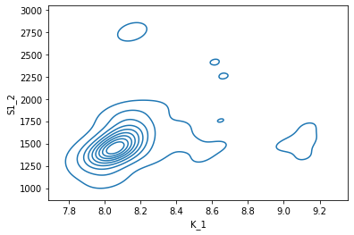

.. code:: python

    # nb.drop("K_2", axis=1, inplace=True)
    with sb.axes_style("darkgrid"):
        g = sb.PairGrid(pd.DataFrame(nb), diag_sharey=False, vars=["K_1", "S1_1", "S1_2"])
        g.map_upper(plt.hexbin, bins='log', gridsize=20, cmap="Blues", mincnt=2)
        g.map_lower(sb.kdeplot, cmap="viridis_r", fill=True)
        g.map_diag(sb.histplot, kde=True)

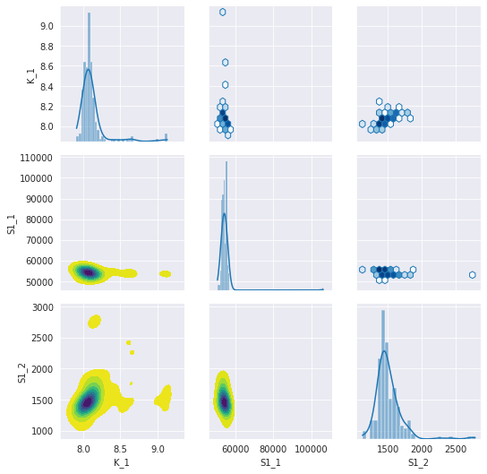

.. code:: python

    sb.violinplot(data=nb, x="K_1", split=True)

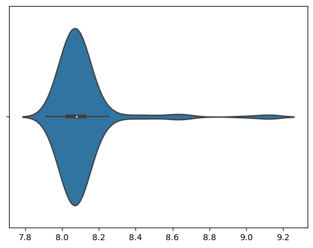

.. code:: python

    g = sb.jointplot(y="S1_2", x="K_1", data=nb, marker="+", s=25, marginal_kws=dict(bins=25, fill=False, kde=True), color="#2075AA", marginal_ticks=True, height=5, ratio=2)
    g.plot_joint(sb.kdeplot, color="r", zorder=0, levels=5)

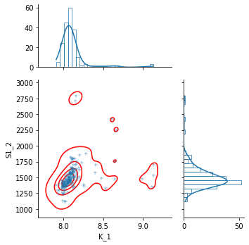

.. code:: python

    g = sb.JointGrid(data=nb, x="K_1", y="S1_2")
    g.plot_joint(sb.histplot)
    g.plot_marginals(sb.boxplot)

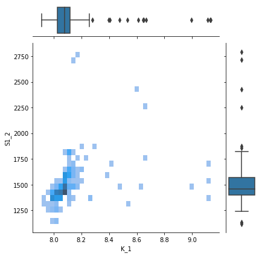

.. code:: python

    f, (ax_box, ax_hist) = plt.subplots(2, sharex=True, gridspec_kw={"height_ratios": (.25, .75)})

    sb.histplot(data=nb, x="K_1", kde=True, ax=ax_hist)

    sb.boxplot(x="K_1", data=nb, whis=[2.5, 97.5], ax=ax_box)
    sb.stripplot(x="K_1", data=nb, color=".3", alpha=0.2, ax=ax_box)
    ax_box.set(xlabel='')
    f.tight_layout()
    # ax = sb.violinplot(x="K_1", data=nb, inner=None, color="r")

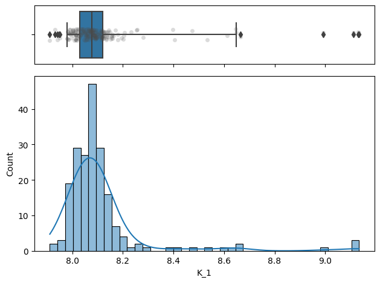

.. code:: python

    import corner

    g = corner.corner(pd.DataFrame(nb)[["K_1", "S1_1", "S1_2"]], labels=list(nb.keys()))

::

    WARNING:root:Too few points to create valid contours

.. image:: ../_static/bs_pd_f7.png

using R
^^^^^^^

.. code:: R

    d <- read.table("../../tests/data/A01.dat")
    fit = nls(V2 ~ (SB + SA * 10 **(pK - V1))/ (1 + 10 ** (pK - V1)), start = list(SB=3e4, SA=3e5, pK=7), data=d)
    summary(fit)
    set.seed(4)

::

    Formula: V2 ~ (SB + SA * 10^(pK - V1))/(1 + 10^(pK - V1))

    Parameters:
        Estimate Std. Error t value Pr(>|t|)
    SB 2.664e+04  2.456e+03   10.85  0.00041 ***
    SA 5.404e+04  9.800e+02   55.15 6.47e-07 ***
    pK 8.070e+00  1.494e-01   54.01 7.03e-07 ***
    ---
    Signif. codes:  0 ‘***’ 0.001 ‘**’ 0.01 ‘*’ 0.05 ‘.’ 0.1 ‘ ’ 1

    Residual standard error: 1754 on 4 degrees of freedom

    Number of iterations to convergence: 9
    Achieved convergence tolerance: 1.51e-06

.. code:: R

    confint(fit)

::

    Waiting for profiling to be done...
               2.5%       97.5%
    SB 18604.738923 32461.32421
    SA 51396.339658 56779.63168
    pK     7.680826     8.48057

.. code:: R

    fz <- function(x, SA1, SB1, SA2, SB2, pK){
      y1 <- (SB1 + SA1 * 10 **(pK - x))/ (1 + 10 ** (pK - x))
      y2 <- (SB2 + SA2 * 10 **(pK - x))/ (1 + 10 ** (pK - x))
      return(rbind(y1,y2))
    }
    ##fitg = nls(rbind(V2, V3) ~ fz(V1, SA1, SB1, SA2, SB2, pK),         start = list(SB1=3e4, SA1=3e5, SB2=3e4, SA2=3e5, pK=7), data=d)
    ##fitg = nls(c(V2, V3) ~ c((SB1 + SA1 * 10 **(pK - V1))/ (1 + 10 ** (pK - V1)), (SB2 + SA2 * 10 **(pK - V1))/ (1 + 10 ** (pK - V1))),         start = list(SB1=3e4, SA1=3e5, SB2=3e4, SA2=3e5, pK=7), data=d)

`https://stats.stackexchange.com/questions/44246/nls-curve-fitting-of-nested-shared-parameters <https://stats.stackexchange.com/questions/44246/nls-curve-fitting-of-nested-shared-parameters>`_

.. code:: R

    library("nlstools")
    n1 <- length(d$V2)
    n2 <- length(d$V3)

    # separate fits:
    fit1 = nls(V2 ~ (SB1 + SA1 * 10 **(pK - V1))/ (1 + 10 ** (pK - V1)),
               start = list(SB1=3e4, SA1=3e5, pK=7), data=d)
    fit2 = nls(V3 ~ (SB2 + SA2 * 10 **(pK - V1))/ (1 + 10 ** (pK - V1)),
               start = list(SB2=3e4, SA2=3e5, pK=7), data=d)

    #set up stacked variables:
    ## y <- c(y1,y2); x <- c(x1,x2)
    y <- c(d$V2,d$V3)

    lcon1 <- rep(c(1,0), c(n1,n2))
    lcon2 <- rep(c(0,1), c(n1,n2))
    mcon1 <- lcon1
    mcon2 <- lcon2

    # combined fit with common 'c' parameter, other parameters separate
    fitg = nls(y ~ mcon1*(SB1 + SA1 * 10 **(pK - V1))/ (1 + 10 ** (pK - V1)) + mcon2*(SB2 + SA2 * 10 **(pK - V1))/ (1 + 10 ** (pK - V1)),
           start = list(SB1=3e4, SA1=3e5, SB2=3e4, SA2=3e5, pK=7), data=d)

    confint2(fitg)
    confint2(fit1)
    confint2(fit2)

::

               2.5 %       97.5 %
    SB1 23376.154137 29826.554415
    SA1 52614.760849 55454.403951
    SB2 22059.687893 28109.136342
    SA2    77.955582  2869.198281
    pK      7.900608     8.244491
              2.5 %      97.5 %
    SB1 19820.10513 33457.59221
    SA1 51322.45855 56764.26498
    pK      7.65479     8.48443
               2.5 %       97.5 %
    SB2 24352.669239 25919.322982
    SA2  1175.819778  1795.244474
    pK      8.022244     8.132196

.. code:: R

    nlstools::confint2(fitg)

::

               2.5 %       97.5 %
    SB1 23376.154137 29826.554415
    SA1 52614.760849 55454.403951
    SB2 22059.687893 28109.136342
    SA2    77.955582  2869.198281
    pK      7.900608     8.244491

.. code:: R

    nlstools::plotfit(fit2)

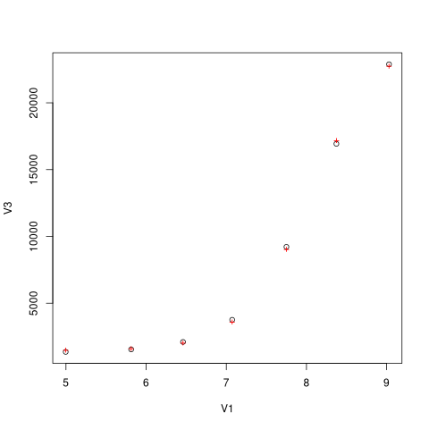

.. code:: R

    nlstools::overview(fitg)

::

    ------
    Formula: y ~ mcon1 * (SB1 + SA1 * 10^(pK - V1))/(1 + 10^(pK - V1)) + mcon2 *
        (SB2 + SA2 * 10^(pK - V1))/(1 + 10^(pK - V1))

    Parameters:
         Estimate Std. Error t value Pr(>|t|)
    SB1 2.660e+04  1.426e+03  18.658 1.67e-08 ***
    SA1 5.403e+04  6.276e+02  86.092 1.95e-14 ***
    SB2 2.508e+04  1.337e+03  18.760 1.60e-08 ***
    SA2 1.474e+03  6.169e+02   2.389   0.0407 *
    pK  8.073e+00  7.601e-02 106.207 2.95e-15 ***
    ---
    Signif. codes:  0 ‘***’ 0.001 ‘**’ 0.01 ‘*’ 0.05 ‘.’ 0.1 ‘ ’ 1

    Residual standard error: 1177 on 9 degrees of freedom

    Number of iterations to convergence: 7
    Achieved convergence tolerance: 7.71e-07

    ------
    Residual sum of squares: 12500000

    ------
    t-based confidence interval:
                2.5%        97.5%
    SB1 23376.154137 29826.554415
    SA1 52614.760849 55454.403951
    SB2 22059.687893 28109.136342
    SA2    77.955582  2869.198281
    pK      7.900608     8.244491

    ------
    Correlation matrix:
                SB1         SA1          SB2          SA2         pK
    SB1  1.00000000  0.06634912 -0.426385167 -0.215493852 -0.6816295
    SA1  0.06634912  1.00000000 -0.225860127 -0.114149066 -0.3610654
    SB2 -0.42638517 -0.22586013  1.000000000  0.002758745  0.6255380
    SA2 -0.21549385 -0.11414907  0.002758745  1.000000000  0.3161451
    pK  -0.68162953 -0.36106540  0.625537996  0.316145125  1.0000000

.. code:: R

    nlstools::test.nlsResiduals(nlstools::nlsResiduals(fitg))

::

    ------
    	Shapiro-Wilk normality test

    data:  stdres
    W = 0.82711, p-value = 0.01102

    ------
    	Runs Test

    data:  as.factor(run)
    Standard Normal = 0.081275, p-value = 0.9352
    alternative hypothesis: two.sided

.. code:: R

    plot(nlstools::nlsResiduals(fitg))
    ## plot(nlsResiduals(fitg))

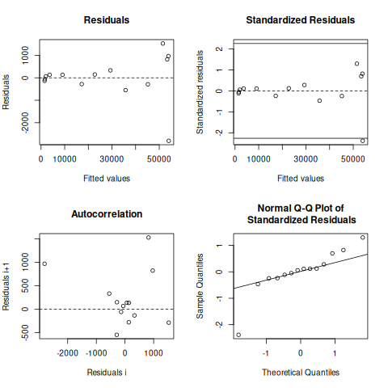

.. code:: R

    plot(nlstools::nlsConfRegions(fit))

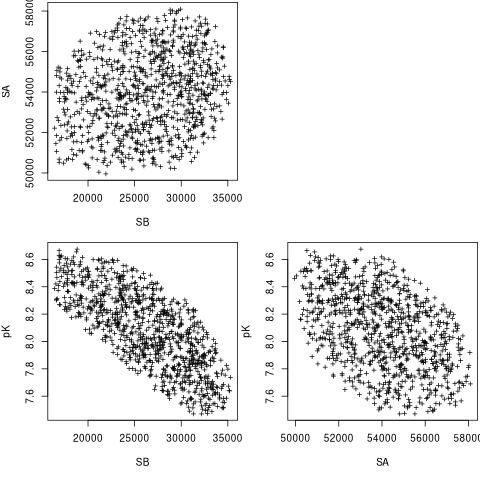

.. code:: R

    plot(nlstools::nlsContourRSS(fit))

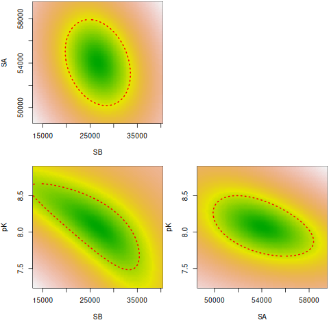

.. code:: R

    library(nlstools)
    nb = nlsBoot(fit, niter=999)
    plot(nb)

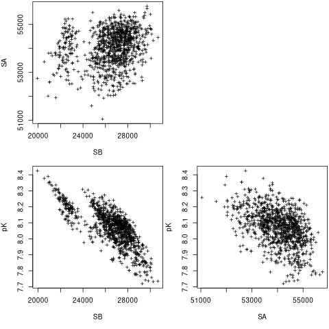

.. code:: R

    plot(nb, type="boxplot")

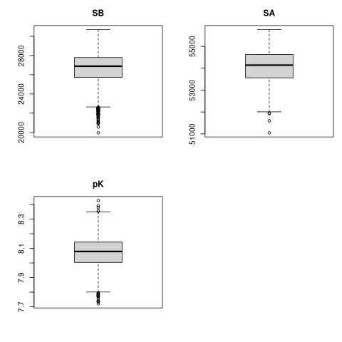

.. code:: R

    summary(nb)

::

    ------
    Bootstrap statistics
           Estimate   Std. error
    SB 26516.059610 1930.5821817
    SA 54049.694523  745.3580575
    pK     8.071597    0.1121147

    ------
    Median of bootstrap estimates and percentile confidence intervals
             Median      2.5%        97.5%
    SB 26887.590883 21927.862 29495.527023
    SA 54141.042940 52421.957 55273.697836
    pK     8.078571     7.833     8.274291

.. code:: R

    plot(nlsJack(fit))

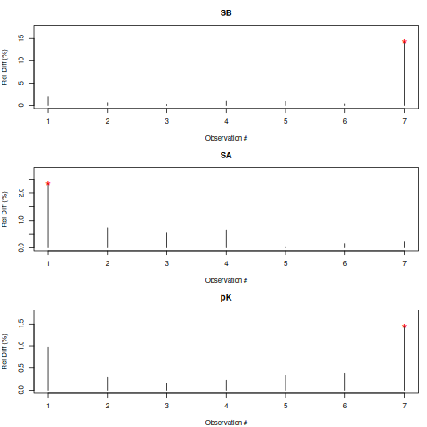

.. code:: R

    summary(nlsJack(fit))

::

    ------
    Jackknife statistics
          Estimates          Bias
    SB 29534.416585 -2.895568e+03
    SA 54043.021568  3.401935e-01
    pK     7.971888  9.772245e-02

    ------
    Jackknife confidence intervals
                Low           Up
    SB 20101.598249 38967.234921
    SA 50408.254863 57677.788274
    pK     7.600316     8.343459

    ------
    Influential values
    * Observation 7 is influential on SB
    * Observation 1 is influential on SA
    * Observation 7 is influential on pK

lmfit.Model
^^^^^^^^^^^

It took 9 vs 5 ms.
It is not possible to do global fitting. In the documentation it is stressed the need to convert the output of the residue to be 1D vectors.

.. code:: python

    mod = lmfit.models.ExpressionModel("(SB + SA * 10**(pK-x)) / (1 + 10**(pK-x))")
    result = mod.fit(np.array(df.y1), x=np.array(df.x), pK=7, SB=7e3, SA=10000)
    print(result.fit_report())

::

    [[Model]]
        Model(_eval)
    [[Fit Statistics]]
        # fitting method   = leastsq
        # function evals   = 44
        # data points      = 7
        # variables        = 3
        chi-square         = 12308015.2
        reduced chi-square = 3077003.79
        Akaike info crit   = 106.658958
        Bayesian info crit = 106.496688
        R-squared          = 0.97973543
    [[Variables]]
        SB:  26638.8739 +/- 2455.97231 (9.22%) (init = 7000)
        SA:  54043.3677 +/- 979.991414 (1.81%) (init = 10000)
        pK:  8.06960807 +/- 0.14940702 (1.85%) (init = 7)
    [[Correlations]] (unreported correlations are < 0.100)
        C(SB, pK) = -0.775
        C(SA, pK) = -0.455
        C(SB, SA) = 0.205

.. code:: python

    plt.plot(df.x, df.y1, 'o')
    plt.plot(df.x, result.init_fit, '--', label='initial fit')
    plt.plot(df.x, result.best_fit, '-', label='best fit')
    plt.legend()

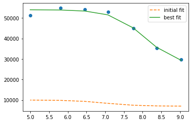

.. code:: python

    print(result.ci_report())

::

          99.73%    95.45%    68.27%    _BEST_    68.27%    95.45%    99.73%
    SB:-85235.77732-8376.43993-2895.5980126638.87391+2558.73803+5999.27655+12360.57068
    SA:-6192.82267-2734.31472-1098.2289154043.36770+1113.17408+2829.53449+6725.36991
    pK:  -0.98139  -0.40197  -0.15948   8.06961  +0.16277  +0.42592  +1.50918

which is faster but still I failed to find the way to global fitting.

.. code:: python

    def tit_pH(x, S0, S1, K):
        return (S0 + S1 * 10 ** (K - x)) / (1 + 10 ** (K - x))

    tit_model1 = lmfit.Model(tit_pH, prefix="ds1_")
    tit_model2 = lmfit.Model(tit_pH, prefix="ds2_")
    print(f'parameter names: {tit_model1.param_names}')
    print(f'parameter names: {tit_model2.param_names}')
    print(f'independent variables: {tit_model1.independent_vars}')
    print(f'independent variables: {tit_model2.independent_vars}')

    tit_model1.set_param_hint('K', value=7.0, min=2.0, max=12.0)
    tit_model1.set_param_hint('S0', value=df.y1[0], min=0.0)
    tit_model1.set_param_hint('S1', value=df.y1.iloc[-1], min=0.0)
    tit_model2.set_param_hint('K', value=7.0, min=2.0, max=12.0)
    tit_model2.set_param_hint('S0', value=df.y1[0], min=0.0)
    tit_model2.set_param_hint('S1', value=df.y1.iloc[-1], min=0.0)
    pars1 = tit_model1.make_params()
    pars2 = tit_model2.make_params()
    # gmodel = tit_model1 + tit_model2
    # result = gmodel.fit(df.y1 + df.y2, pars, x=df.x)
    res1 = tit_model1.fit(df.y1, pars1, x=df.x)
    res2 = tit_model2.fit(df.y2, pars2, x=df.x)
    print(res1.fit_report())
    print(res2.fit_report())

::

    parameter names: ['ds1_S0', 'ds1_S1', 'ds1_K']
    parameter names: ['ds2_S0', 'ds2_S1', 'ds2_K']
    independent variables: ['x']
    independent variables: ['x']
    [[Model]]
        Model(tit_pH, prefix='ds1_')
    [[Fit Statistics]]
        # fitting method   = leastsq
        # function evals   = 25
        # data points      = 7
        # variables        = 3
        chi-square         = 12308015.2
        reduced chi-square = 3077003.79
        Akaike info crit   = 106.658958
        Bayesian info crit = 106.496688
        R-squared          = 0.97973543
    [[Variables]]
        ds1_S0:  26638.8364 +/- 2455.91626 (9.22%) (init = 29657)
        ds1_S1:  54043.3589 +/- 979.996129 (1.81%) (init = 51205)
        ds1_K:   8.06961101 +/- 0.14940677 (1.85%) (init = 7)
    [[Correlations]] (unreported correlations are < 0.100)
        C(ds1_S0, ds1_K)  = -0.775
        C(ds1_S1, ds1_K)  = -0.455
        C(ds1_S0, ds1_S1) = 0.205
    [[Model]]
        Model(tit_pH, prefix='ds2_')
    [[Fit Statistics]]
        # fitting method   = leastsq
        # function evals   = 33
        # data points      = 7
        # variables        = 3
        chi-square         = 159980.530
        reduced chi-square = 39995.1326
        Akaike info crit   = 76.2582808
        Bayesian info crit = 76.0960112
        R-squared          = 0.99963719
    [[Variables]]
        ds2_S0:  25135.9917 +/- 282.132353 (1.12%) (init = 29657)
        ds2_S1:  1485.53109 +/- 111.550019 (7.51%) (init = 51205)
        ds2_K:   8.07721961 +/- 0.01980087 (0.25%) (init = 7)
    [[Correlations]] (unreported correlations are < 0.100)
        C(ds2_S0, ds2_K)  = 0.777
        C(ds2_S1, ds2_K)  = 0.455
        C(ds2_S0, ds2_S1) = 0.205

.. code:: python

    xfit_delta = (df.x.max() - df.x.min()) / 100
    xfit = np.arange(df.x.min() - xfit_delta, df.x.max() + xfit_delta, xfit_delta)
    dely1 = res1.eval_uncertainty(x=xfit) * 1
    dely2 = res2.eval_uncertainty(x=xfit) * 1
    best_fit1 = res1.eval(x=xfit)
    best_fit2 = res2.eval(x=xfit)
    plt.plot(df.x, df.y1, "o")
    plt.plot(df.x, df.y2, "o")
    plt.plot(xfit, best_fit1,"-.")
    plt.plot(xfit, best_fit2,"-.")
    plt.fill_between(xfit, best_fit1 - dely1, best_fit1 + dely1, color='#FEDCBA', alpha=0.5)
    plt.fill_between(xfit, best_fit2 - dely2, best_fit2 + dely2, color='#FEDCBA', alpha=0.5)

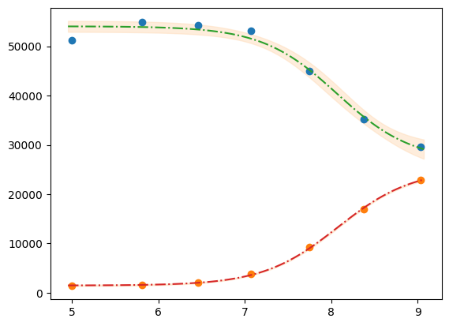

Please mind the difference in the uncertainty between the 2 label blocks.

.. code:: python

    def tit_pH2(x, S0_1, S0_2, S1_1, S1_2, K):
        y1 = (S0_1 + S1_1 * 10 **(K - x)) / (1 + 10 **(K - x))
        y2 = (S0_2 + S1_2 * 10 **(K - x)) / (1 + 10 **(K - x))
        # return y1, y2
        return np.r_[y1, y2]

    tit_model = lmfit.Model(tit_pH2)
    tit_model.set_param_hint('K', value=7.0, min=2.0, max=12.0)
    tit_model.set_param_hint('S0_1', value=df.y1[0], min=0.0)
    tit_model.set_param_hint('S0_2', value=df.y2[0], min=0.0)
    tit_model.set_param_hint('S1_1', value=df.y1.iloc[-1], min=0.0)
    tit_model.set_param_hint('S1_2', value=df.y2.iloc[-1], min=0.0)
    pars = tit_model.make_params()
    # res = tit_model.fit([df.y1, df.y2], pars, x=df.x)
    res = tit_model.fit(np.r_[df.y1, df.y2], pars, x=df.x)
    print(res.fit_report())

::

    [[Model]]
        Model(tit_pH2)
    [[Fit Statistics]]
        # fitting method   = leastsq
        # function evals   = 37
        # data points      = 14
        # variables        = 5
        chi-square         = 12471473.3
        reduced chi-square = 1385719.25
        Akaike info crit   = 201.798560
        Bayesian info crit = 204.993846
        R-squared          = 0.99794717
    [[Variables]]
        S0_1:  26601.3422 +/- 1425.69369 (5.36%) (init = 29657)
        S0_2:  25084.4220 +/- 1337.07555 (5.33%) (init = 22885)
        S1_1:  54034.5797 +/- 627.642878 (1.16%) (init = 51205)
        S1_2:  1473.57942 +/- 616.944953 (41.87%) (init = 1358)
        K:     8.07255057 +/- 0.07600744 (0.94%) (init = 7)
    [[Correlations]] (unreported correlations are < 0.100)
        C(S0_1, K)    = -0.682
        C(S0_2, K)    = 0.626
        C(S0_1, S0_2) = -0.426
        C(S1_1, K)    = -0.361
        C(S1_2, K)    = 0.316
        C(S0_2, S1_1) = -0.226
        C(S0_1, S1_2) = -0.215
        C(S1_1, S1_2) = -0.114

.. code:: python

    dely = res.eval_uncertainty(x=xfit)
    # res.plot() # this return error because of the global fit

.. code:: python

    def fit_pH(fp):
        df = pd.read_csv(fp)
        def tit_pH(x, SA, SB, pK):
            return (SB + SA * 10 ** (pK - x)) / (1 + 10 ** (pK - x))
        mod = lmfit.Model(tit_pH)
        pars = mod.make_params(SA=10000, SB=7e3, pK=7)
        result = mod.fit(df.y2, pars, x=df.x)
        return result, df.y2, df.x, mod

    # r,y,x,model = fit_pH("/home/dati/ibf/IBF/Database/Random mutag results/Liasan-analyses/2016-05-19/2014-02-20/pH/dat/C12.dat")
    r,y,x,model = fit_pH("../../tests/data/H04.dat")
    xfit = np.linspace(x.min(),x.max(),50)
    dely = r.eval_uncertainty(x=xfit) * 1
    best_fit = r.eval(x=xfit)
    plt.plot(x, y, "o")
    plt.plot(xfit, best_fit,"-.")
    plt.fill_between(xfit, best_fit-dely,
                     best_fit+dely, color='#FEDCBA', alpha=0.5)
    r.conf_interval(sigmas=[2])
    print(r.ci_report(with_offset=False, ndigits=2))

::

       99.73% 95.45% 68.27% _BEST_ 68.27% 95.45% 99.73%
    SA:2338.404511.625450.156052.536642.137512.329321.96
    SB:33406.9634609.8235170.9935544.4435920.0736492.8937756.24
    pK:   6.47   6.60   6.66   6.70   6.74   6.80   6.93

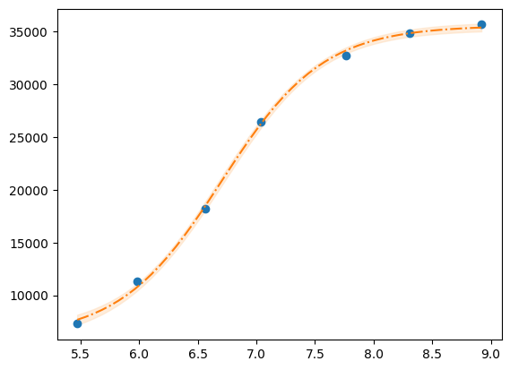

.. code:: python

    g = r.plot()

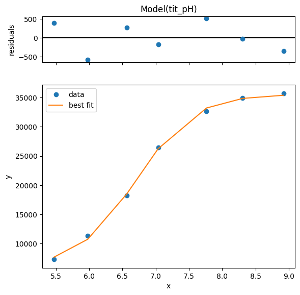

.. code:: python

    print(r.ci_report())

::

          99.73%    95.45%    68.27%    _BEST_    68.27%    95.45%    99.73%
    SA:-3714.12523-1540.90611-602.372266052.52642+589.60360+1459.79555+3269.43112
    SB:-2137.47471-934.62390-373.4473135544.43896+375.63195+948.44897+2211.80126
    pK:  -0.23398  -0.10021  -0.03976   6.70122  +0.03971  +0.09989  +0.23227

.. code:: python

    emcee_kws = dict(steps=2000, burn=500, thin=2, is_weighted=False,
                     progress=False)
    emcee_params = r.params.copy()
    emcee_params.add('__lnsigma', value=np.log(0.1), min=np.log(0.001), max=np.log(2000.0))
    result_emcee = model.fit(data=y, x=x, params=emcee_params, method='emcee',
                             nan_policy='omit', fit_kws=emcee_kws)

    lmfit.report_fit(result_emcee)

::

    The chain is shorter than 50 times the integrated autocorrelation time for 4 parameter(s). Use this estimate with caution and run a longer chain!
    N/50 = 40;
    tau: [46.79373445 51.93012345 40.4955552  89.70949742]
    [[Fit Statistics]]
        # fitting method   = emcee
        # function evals   = 200000
        # data points      = 7
        # variables        = 4
        chi-square         = 3.33295342
        reduced chi-square = 1.11098447
        Akaike info crit   = 2.80564072
        Bayesian info crit = 2.58928132
        R-squared          = 1.00000000
    [[Variables]]
        SA:         6033.16338 +/- 597.312717 (9.90%) (init = 6052.526)
        SB:         35545.1923 +/- 379.344928 (1.07%) (init = 35544.44)
        pK:         6.70058390 +/- 0.03921574 (0.59%) (init = 6.701225)
        __lnsigma:  6.30231251 +/- 0.38825321 (6.16%) (init = -2.302585)
    [[Correlations]] (unreported correlations are < 0.100)
        C(SA, pK) = 0.717
        C(SB, pK) = 0.518
        C(SA, SB) = 0.200

.. code:: python

    result_emcee.plot_fit()

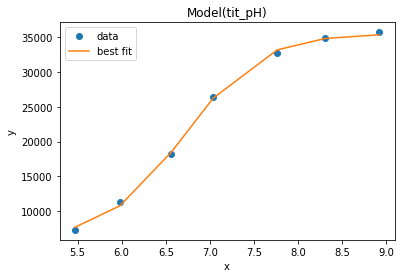

.. code:: python

    emcee_corner = corner.corner(result_emcee.flatchain, labels=result_emcee.var_names,
                                 truths=list(result_emcee.params.valuesdict().values()))

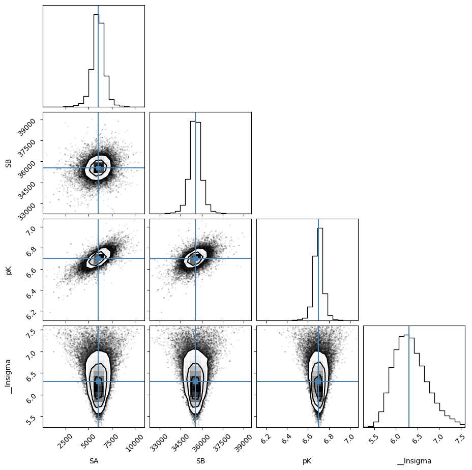

.. code:: python

    highest_prob = np.argmax(result_emcee.lnprob)
    hp_loc = np.unravel_index(highest_prob, result_emcee.lnprob.shape)
    mle_soln = result_emcee.chain[hp_loc]
    print("\nMaximum Likelihood Estimation (MLE):")
    print('----------------------------------')
    for ix, param in enumerate(emcee_params):
        print(f"{param}: {mle_soln[ix]:.3f}")

    quantiles = np.percentile(result_emcee.flatchain['pK'], [2.28, 15.9, 50, 84.2, 97.7])
    print(f"\n\n1 sigma spread = {0.5 * (quantiles[3] - quantiles[1]):.3f}")
    print(f"2 sigma spread = {0.5 * (quantiles[4] - quantiles[0]):.3f}")

::

    Maximum Likelihood Estimation (MLE):
    ----------------------------------
    SA: 6019.885
    SB: 35528.699
    pK: 6.699
    __lnsigma: 5.939

    1 sigma spread = 0.039
    2 sigma spread = 0.098

TODO See also this tutorial
~~~~~~~~~~~~~~~~~~~~~~~~~~~

`https://www.astro.rug.nl/software/kapteyn/kmpfittutorial.html <https://www.astro.rug.nl/software/kapteyn/kmpfittutorial.html>`_

TODO jackknife to auto-reject
^^^^^^^^^^^^^^^^^^^^^^^^^^^^^

TODO uncertainty estimate
^^^^^^^^^^^^^^^^^^^^^^^^^

Example 2P Cl–ratio
-------------------

using lmfit.model
~~~~~~~~~~~~~~~~~

.. code:: python

    def fit_Rcl(fp):
        df = pd.read_table(fp)
        def R_Cl(cl, R0, R1, Kd):
            return (R1 * cl + R0 * Kd)/(Kd + cl)
        mod = lmfit.Model(R_Cl)
        pars = mod.make_params(R0=0.8, R1=0.05, Kd=10)
        result = mod.fit(df.R, pars, cl=df.cl)
        return result, df.R, df.cl, mod

    r,y,x,model = fit_Rcl("../../tests/data/ratio2P.txt")
    xfit = np.linspace(x.min(),x.max(),50)
    dely = r.eval_uncertainty(cl=xfit) * 3
    best_fit = r.eval(cl=xfit)
    plt.plot(x, y, "o")
    plt.grid()
    plt.plot(xfit, best_fit,"-.")
    plt.fill_between(xfit, best_fit-dely,
                     best_fit+dely, color='#FEDCBA', alpha=0.5)
    r.conf_interval(sigmas=[2])
    print(r.ci_report(with_offset=False, ndigits=2))

::

       99.73% 95.45% 68.27% _BEST_ 68.27% 95.45% 99.73%
    R0:   0.49   0.58   0.60   0.61   0.62   0.64   0.73
    R1:  -0.30  -0.01   0.03   0.04   0.06   0.09   0.20
    Kd:   2.95  10.09  12.51  13.66  14.91  18.49  59.97

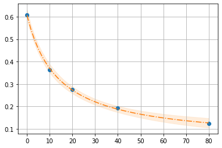

.. code:: python

    emcee_kws = dict(steps=3000, burn=300, thin=2, is_weighted=False,
                     progress=False)
    emcee_params = r.params.copy()
    emcee_params.add('__lnsigma', value=np.log(0.1), min=np.log(0.000001), max=np.log(2000.0))
    result_emcee = model.fit(data=y, cl=x, params=emcee_params, method='emcee',
                             nan_policy='omit', fit_kws=emcee_kws)

::

    The chain is shorter than 50 times the integrated autocorrelation time for 2 parameter(s). Use this estimate with caution and run a longer chain!
    N/50 = 60;
    tau: [ 83.72116791  47.29844186  47.96365641 198.21874013]

.. code:: python

    lmfit.report_fit(result_emcee)

::

    [[Fit Statistics]]
        # fitting method   = emcee
        # function evals   = 300000
        # data points      = 5
        # variables        = 4
        chi-square         = 1.01491984
        reduced chi-square = 1.01491984
        Akaike info crit   = 0.02685860
        Bayesian info crit = -1.53538975
        R-squared          = -6.14152912
    [[Variables]]
        R0:         0.60540963 +/- 0.01716324 (2.83%) (init = 0.6071065)
        R1:         0.04245431 +/- 0.02352093 (55.40%) (init = 0.04390401)
        Kd:         13.8169352 +/- 2.11632273 (15.32%) (init = 13.66125)
        __lnsigma: -4.71757393 +/- 1.52902499 (32.41%) (init = -2.302585)
    [[Correlations]] (unreported correlations are < 0.100)
        C(R1, Kd)        = -1.000
        C(R0, __lnsigma) = -0.303

.. code:: python

    emcee_corner = corner.corner(result_emcee.flatchain, labels=result_emcee.var_names,
                                 truths=list(result_emcee.params.valuesdict().values()))

::

    WARNING:root:Too few points to create valid contours
    WARNING:root:Too few points to create valid contours
    WARNING:root:Too few points to create valid contours
    WARNING:root:Too few points to create valid contours
    WARNING:root:Too few points to create valid contours
    WARNING:root:Too few points to create valid contours

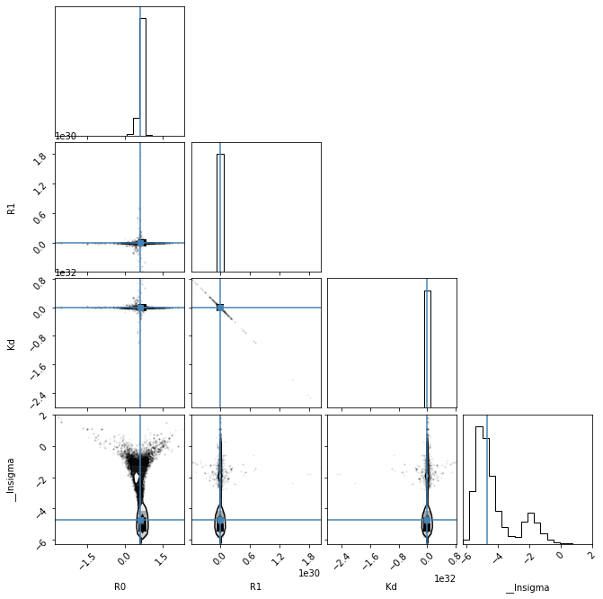

.. code:: python

    highest_prob = np.argmax(result_emcee.lnprob)
    hp_loc = np.unravel_index(highest_prob, result_emcee.lnprob.shape)
    mle_soln = result_emcee.chain[hp_loc]
    print("\nMaximum Likelihood Estimation (MLE):")
    print('----------------------------------')
    for ix, param in enumerate(emcee_params):
        print(f"{param}: {mle_soln[ix]:.3f}")

    quantiles = np.percentile(result_emcee.flatchain['Kd'], [2.28, 15.9, 50, 84.2, 97.7])
    print(f"\n\n1 sigma spread = {0.5 * (quantiles[3] - quantiles[1]):.3f}")
    print(f"2 sigma spread = {0.5 * (quantiles[4] - quantiles[0]):.3f}")

::

    Maximum Likelihood Estimation (MLE):
    ----------------------------------
    R0: 0.607
    R1: 0.045
    Kd: 13.602
    __lnsigma: -5.555

    1 sigma spread = 2.127
    2 sigma spread = 917154430706916272373760.000

using R
~~~~~~~

.. code:: R

    d <- read.delim("../../tests/data/ratio2P.txt")
    fitr = nls(R ~ (R1 * cl + R0 * Kd)/(Kd + cl), start = list(R0=0.8, R1=0.05, Kd=10), data=d)
    nlstools::overview(fitr)

::

    ------
    Formula: R ~ (R1 * cl + R0 * Kd)/(Kd + cl)

    Parameters:
        Estimate Std. Error t value Pr(>|t|)
    R0  0.607106   0.006197  97.965 0.000104 ***
    R1  0.043904   0.010314   4.257 0.051000 .
    Kd 13.661249   0.895076  15.263 0.004265 **
    ---
    Signif. codes:  0 ‘***’ 0.001 ‘**’ 0.01 ‘*’ 0.05 ‘.’ 0.1 ‘ ’ 1

    Residual standard error: 0.006231 on 2 degrees of freedom

    Number of iterations to convergence: 5
    Achieved convergence tolerance: 2.164e-06

    ------
    Residual sum of squares: 7.76e-05

    ------
    t-based confidence interval:
                2.5%      97.5%
    R0  0.5804421912  0.6337708
    R1 -0.0004723916  0.0882804
    Kd  9.8100489312 17.5124485

    ------
    Correlation matrix:
               R0         R1         Kd
    R0  1.0000000  0.1481828 -0.4238954
    R1  0.1481828  1.0000000 -0.8612579
    Kd -0.4238954 -0.8612579  1.0000000

.. code:: R

    nlstools::test.nlsResiduals(nlstools::nlsResiduals(fitr))

::

    ------
    	Shapiro-Wilk normality test

    data:  stdres
    W = 0.8952, p-value = 0.3839

    ------
    	Runs Test

    data:  as.factor(run)
    Standard Normal = 0.65465, p-value = 0.5127
    alternative hypothesis: two.sided

.. code:: R

    plot(nlstools::nlsResiduals(fitr))

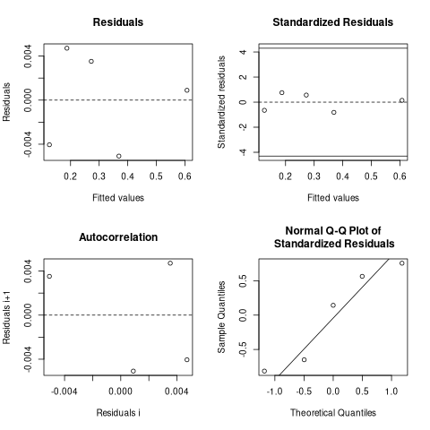

.. code:: R

    plot(nlstools::nlsConfRegions(fitr))

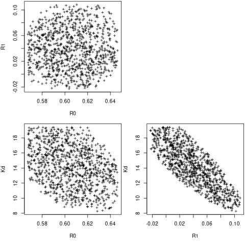

.. code:: R

    plot(nlstools::nlsContourRSS(fitr))

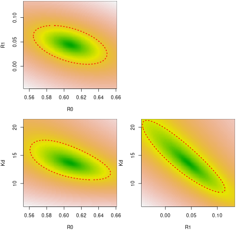

.. code:: R

    library(nlstools)
    set.seed(4)
    nb = nlsBoot(fitr, niter=999)
    plot(nb)

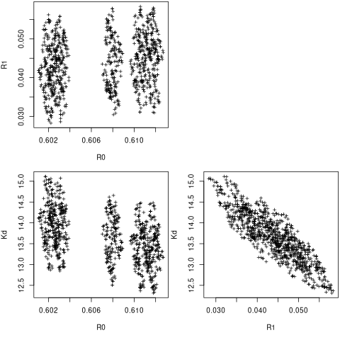

.. code:: R

    plot(nb, type="boxplot")

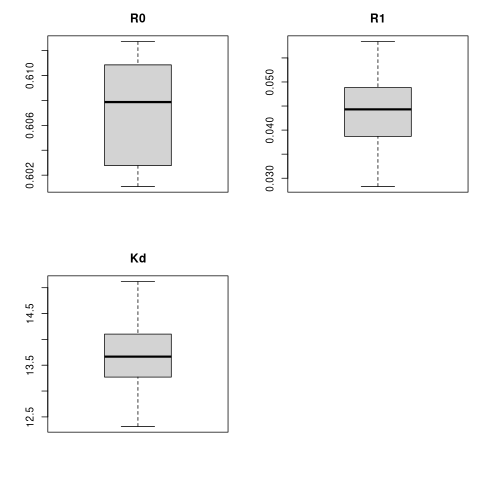

.. code:: R

    summary(nb)

::

    ------
    Bootstrap statistics
          Estimate  Std. error
    R0  0.60701704 0.003940589
    R1  0.04388451 0.006595830
    Kd 13.67402020 0.571780243

    ------
    Median of bootstrap estimates and percentile confidence intervals
            Median        2.5%       97.5%
    R0  0.60786727  0.60160431  0.61225102
    R1  0.04430874  0.03139322  0.05609658
    Kd 13.66608898 12.50884400 14.80687686

.. code:: R

    plot(nlsJack(fitr))

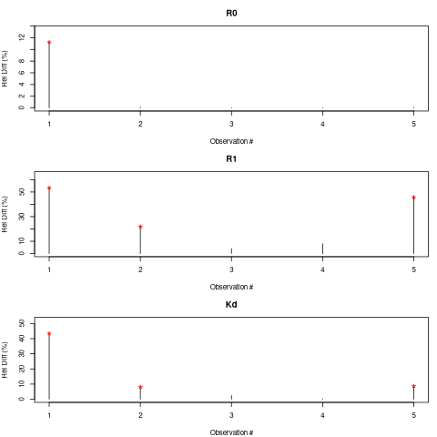

.. code:: R

    summary(nlsJack(fitr))

::

    ------
    Jackknife statistics
        Estimates        Bias
    R0 0.65998921 -0.05288272
    R1 0.05557924 -0.01167524
    Kd 9.23221855  4.42903016

    ------
    Jackknife confidence intervals
                Low         Up
    R0   0.42359388  0.8963845
    R1  -0.06687494  0.1780334
    Kd -12.39589872 30.8603358

    ------
    Influential values
    * Observation 1 is influential on R0
    * Observation 1 is influential on R1
    * Observation 2 is influential on R1
    * Observation 5 is influential on R1
    * Observation 1 is influential on Kd
    * Observation 2 is influential on Kd
    * Observation 5 is influential on Kd

Old scripts
-----------

``fit_titration.py``
~~~~~~~~~~~~~~~~~~~~

- input ← csvtable and note \_file

  - csvtable

  .. image:: ../_static/csvtable.png

  - note \_file

  .. image:: ../_static/note_file.png

- output → pK spK and pdf of analysis

It is a unique script for pK and Cl and various methods:

1. svd

2. bands

3. single lambda

and bootstraping

I do not know how to unittest
TODO

- average spectra

- join spectra ['B', 'E', 'F']

- compute band integral (or sums)

``fit_titration_global.py``
~~~~~~~~~~~~~~~~~~~~~~~~~~~

A script for fitting tuples (y1, y2) of values for each concentration (x). It uses lmfit confint and bootstrap.

- input ← x y1 y2 (file)

  - file

  .. image:: ../_static/file.png

- output →

  - params: K SA1 SB1 SA2 SB2

  - fit.png

  - correl.png

It uses lmfit confint and bootstrap. In global fit the best approach was using lmfit without bootstrap.

.. code:: bash

    for i in *.dat; do gfit $i png2 --boot 99 > png2/$i.txt; done

IBF database uses
~~~~~~~~~~~~~~~~~

Bash scripts (probably moved into prtecan) for:

- ``fit_titration_global.py``

  - `../../src/clophfit/old/bash/fit.tecan <../../src/clophfit/old/bash/fit.tecan>`_

  - `../../src/clophfit/old/bash/fit.tecan.cl <../../src/clophfit/old/bash/fit.tecan.cl>`_

- ``fit_titration.py``

  .. code:: sh

      cd 2014-xx-xx

      (prparser) pr.enspire *.csv

      fit_titration.py meas/Copy_daniele00_893_A.csv A02_37_note.csv -d fit/37C | tee fit/svd_Copy_daniele00_893_A_A02_37_note.txt

      w_ave.sh > pKa.txt

      head pKa??/pKa.txt >> Readme.txt

      # fluorimeter data
      ls > list
      merge.py list
      fit_titration *.csv fluo_note

see: `/home/dati/ibf/IBF/Database/Data and protocols_Liaisan/library after Omnichange mutagenesis/Readme_howto.txt </home/dati/ibf/IBF/Database/Data and protocols_Liaisan/library after Omnichange mutagenesis/Readme_howto.txt>`_
