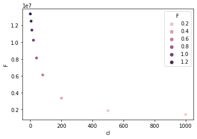

.. contents::

numdifftols can be removed; mpi4py too.

Conventions:

- S0 Signal for unbound state

- S1 Signal for bound state

- K equilibrium constant (Kd or pKa)

- order data from unbound to bound (e.g. cl: 0–>150 mM; pH 9–>5)

  Summary:

- lmfit.Model has very convenient results plot functionalities and the unique possibility to estimate upper lower fitting curves.

- R nls and nlsboot seems very convenient (Q-Q plt) and fast; nls can perform global fit but nlstools can not.

-

1 lmfit, bootstrap and rpy2
---------------------------

.. code:: python

    import numpy as np
    import scipy
    import pandas as pd
    import matplotlib.pyplot as plt
    import seaborn as sb
    import rpy2
    from rpy2.robjects import r
    from rpy2.robjects.packages import importr
    from rpy2.robjects import globalenv
    from rpy2.robjects import pandas2ri
    import lmfit

    pandas2ri.activate()
    %load_ext rpy2.ipython

    MASS = importr('MASS')
    #r('library(MASS)')

Single Cl titration.

.. code:: python

    df = pd.read_table("../tests/data/copyIP.txt")
    sb.scatterplot(data=df, x="cl", y="F", hue="F")

::

    <AxesSubplot:xlabel='cl', ylabel='F'>

